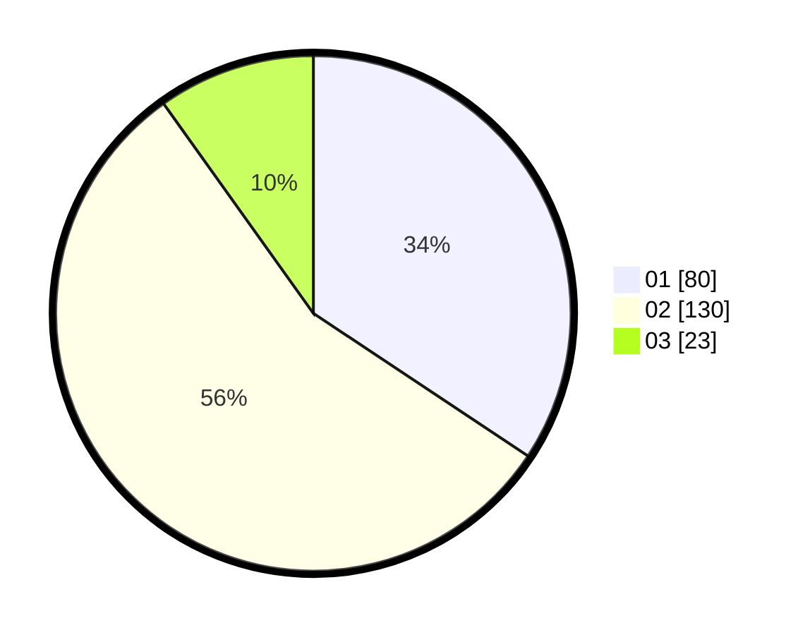

# Hasil

Hasil perolehan suara paslon dapat dilihat pada file paslon-01.txt, paslon-02.txt, dan paslon-03.txt.

Jika tidak ada, artinya data tersebut belum ada pada SIREKAP.

## Perolehan Suara

 * Paslon 01: **80**.
 * Paslon 02: **130**.
 * Paslon 03: **23**.

## Foto C Plano

https://sirekap-obj-formc.kpu.go.id/13f7/pemilu/ppwp/31/75/05/10/04/3175051004103-20240214-155919--28d7997d-0d02-4e00-be7f-c622e3cd016b.jpg

https://sirekap-obj-formc.kpu.go.id/13f7/pemilu/ppwp/31/75/05/10/04/3175051004103-20240214-193229--09d935e4-4719-4ec5-9d9e-97fea7fe34cb.jpg

https://sirekap-obj-formc.kpu.go.id/13f7/pemilu/ppwp/31/75/05/10/04/3175051004103-20240214-193240--1079271b-e354-40e9-ab9d-aeec10f6904a.jpg

## DATA PEMILIH TETAP

Jumlah pemilih dalam DPT: **277**.
 * L: **140**.
 * P: **137**.

## DATA PENGGUNA HAK PILIH

Jumlah pengguna hak pilih dalam DPT: **228**.
 * L: **114**.
 * P: **114**.

Jumlah pengguna hak pilih dalam DPTb: **0**.
 * L: **0**.
 * P: **0**.

Jumlah pengguna hak pilih dalam DPK: **6**.
 * L: **3**.
 * P: **3**.

Jumlah pengguna hak pilih: **234**.
 * L: **117**.
 * P: **117**.

## JUMLAH SUARA SAH DAN TIDAK SAH

JUMLAH SELURUH SUARA SAH: **233**.

JUMLAH SUARA TIDAK SAH: **1**.

JUMLAH SELURUH SUARA SAH DAN SUARA TIDAK SAH: **234**.
