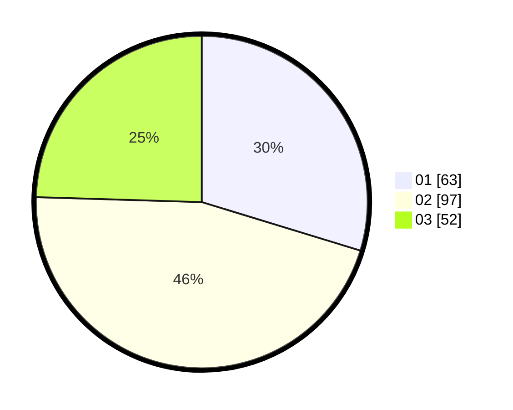

# Hasil

Hasil perolehan suara paslon dapat dilihat pada file paslon-01.txt, paslon-02.txt, dan paslon-03.txt.

Jika tidak ada, artinya data tersebut belum ada pada SIREKAP.

## Perolehan Suara

 * Paslon 01: **63**.
 * Paslon 02: **97**.
 * Paslon 03: **52**.

## Foto C Plano

https://sirekap-obj-formc.kpu.go.id/bb5c/pemilu/ppwp/31/75/05/10/04/3175051004118-20240215-072555--b4bb5e07-bd94-4c3e-857f-44d33c2de488.jpg

https://sirekap-obj-formc.kpu.go.id/bb5c/pemilu/ppwp/31/75/05/10/04/3175051004118-20240215-072701--e4cb5ff9-d091-40b8-b2e6-37734a044b25.jpg

https://sirekap-obj-formc.kpu.go.id/bb5c/pemilu/ppwp/31/75/05/10/04/3175051004118-20240215-072806--f267e558-9c9d-493a-9d1c-dcd3c3bf346a.jpg
