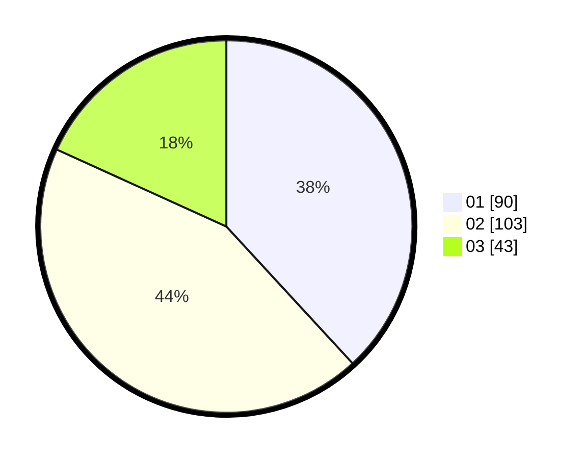

# Hasil

Hasil perolehan suara paslon dapat dilihat pada file paslon-01.txt, paslon-02.txt, dan paslon-03.txt.

Jika tidak ada, artinya data tersebut belum ada pada SIREKAP.

## Perolehan Suara

 * Paslon 01: **90**.
 * Paslon 02: **103**.
 * Paslon 03: **43**.

## Foto C Plano

https://sirekap-obj-formc.kpu.go.id/1ae5/pemilu/ppwp/31/75/05/10/04/3175051004123-20240214-184539--2c2a3129-ca95-40ae-9d02-d13d74c6a72d.jpg

https://sirekap-obj-formc.kpu.go.id/1ae5/pemilu/ppwp/31/75/05/10/04/3175051004123-20240214-185511--97fcdad8-8b1e-4b25-a1aa-d11edbbcb3bb.jpg

https://sirekap-obj-formc.kpu.go.id/1ae5/pemilu/ppwp/31/75/05/10/04/3175051004123-20240214-185616--f1bf42e3-3b24-471a-a149-c91b734c736c.jpg

## DATA PEMILIH TETAP

Jumlah pemilih dalam DPT: **286**.
 * L: **146**.
 * P: **140**.

## DATA PENGGUNA HAK PILIH

Jumlah pengguna hak pilih dalam DPT: **234**.
 * L: **112**.
 * P: **122**.

Jumlah pengguna hak pilih dalam DPTb: **3**.
 * L: **3**.
 * P: **0**.

Jumlah pengguna hak pilih dalam DPK: **3**.
 * L: **3**.
 * P: **0**.

Jumlah pengguna hak pilih: **240**.
 * L: **118**.
 * P: **122**.

## JUMLAH SUARA SAH DAN TIDAK SAH

JUMLAH SELURUH SUARA SAH: **236**.

JUMLAH SUARA TIDAK SAH: **4**.

JUMLAH SELURUH SUARA SAH DAN SUARA TIDAK SAH: **240**.
