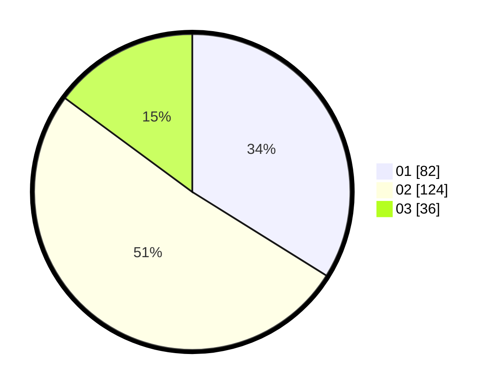

# Hasil

Hasil perolehan suara paslon dapat dilihat pada file paslon-01.txt, paslon-02.txt, dan paslon-03.txt.

Jika tidak ada, artinya data tersebut belum ada pada SIREKAP.

## Perolehan Suara

 * Paslon 01: **82**.
 * Paslon 02: **124**.
 * Paslon 03: **36**.

## Foto C Plano

https://sirekap-obj-formc.kpu.go.id/6293/pemilu/ppwp/31/75/05/10/04/3175051004125-20240214-200203--ae74428c-e384-4c94-8026-7a56a2b67396.jpg

https://sirekap-obj-formc.kpu.go.id/6293/pemilu/ppwp/31/75/05/10/04/3175051004125-20240214-200258--74107d43-ac87-4598-b3e0-46548e043d7c.jpg

https://sirekap-obj-formc.kpu.go.id/6293/pemilu/ppwp/31/75/05/10/04/3175051004125-20240214-200347--e8a4f165-856d-4254-b005-1c0459a35dea.jpg

## DATA PEMILIH TETAP

Jumlah pemilih dalam DPT: **297**.
 * L: **138**.
 * P: **152**.

## DATA PENGGUNA HAK PILIH

Jumlah pengguna hak pilih dalam DPT: **776**.
 * L: **109**.
 * P: **177**.

Jumlah pengguna hak pilih dalam DPTb: **4**.
 * L: **407**.
 * P: **47**.

Jumlah pengguna hak pilih dalam DPK: **701**.
 * L: **0**.
 * P: **1**.

Jumlah pengguna hak pilih: **245**.
 * L: **116**.
 * P: **124**.

## JUMLAH SUARA SAH DAN TIDAK SAH

JUMLAH SELURUH SUARA SAH: **242**.

JUMLAH SUARA TIDAK SAH: **3**.

JUMLAH SELURUH SUARA SAH DAN SUARA TIDAK SAH: **245**.
