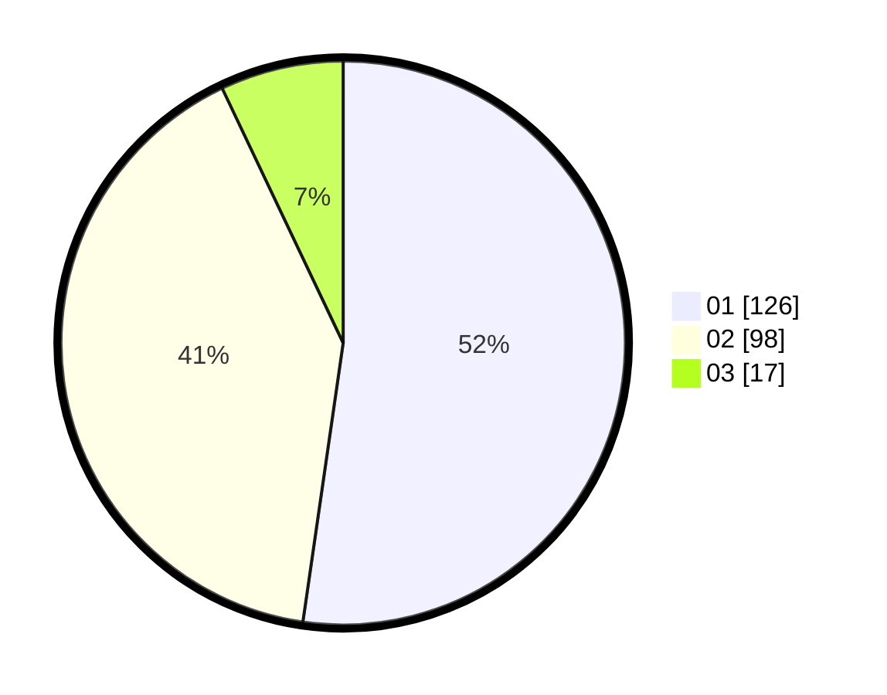

# Hasil

Hasil perolehan suara paslon dapat dilihat pada file paslon-01.txt, paslon-02.txt, dan paslon-03.txt.

Jika tidak ada, artinya data tersebut belum ada pada SIREKAP.

## Perolehan Suara

 * Paslon 01: **126**.
 * Paslon 02: **98**.
 * Paslon 03: **17**.

## Foto C Plano

https://sirekap-obj-formc.kpu.go.id/9d96/pemilu/ppwp/31/75/05/10/04/3175051004126-20240214-155618--c627b26a-d3c8-4a33-ae3a-33adc6b45618.jpg

https://sirekap-obj-formc.kpu.go.id/9d96/pemilu/ppwp/31/75/05/10/04/3175051004126-20240215-202649--abbb1c32-09e9-4665-9dd5-4d45daecd247.jpg

https://sirekap-obj-formc.kpu.go.id/9d96/pemilu/ppwp/31/75/05/10/04/3175051004126-20240214-155500--b9863fdc-4547-4ec0-a455-82e66d60e669.jpg

## DATA PEMILIH TETAP

Jumlah pemilih dalam DPT: **292**.
 * L: **134**.
 * P: **158**.

## DATA PENGGUNA HAK PILIH

Jumlah pengguna hak pilih dalam DPT: **241**.
 * L: **104**.
 * P: **137**.

Jumlah pengguna hak pilih dalam DPTb: **1**.
 * L: **0**.
 * P: **1**.

Jumlah pengguna hak pilih dalam DPK: **4**.
 * L: **1**.
 * P: **3**.

Jumlah pengguna hak pilih: **246**.
 * L: **105**.
 * P: **141**.

## JUMLAH SUARA SAH DAN TIDAK SAH

JUMLAH SELURUH SUARA SAH: **241**.

JUMLAH SUARA TIDAK SAH: **5**.

JUMLAH SELURUH SUARA SAH DAN SUARA TIDAK SAH: **246**.
