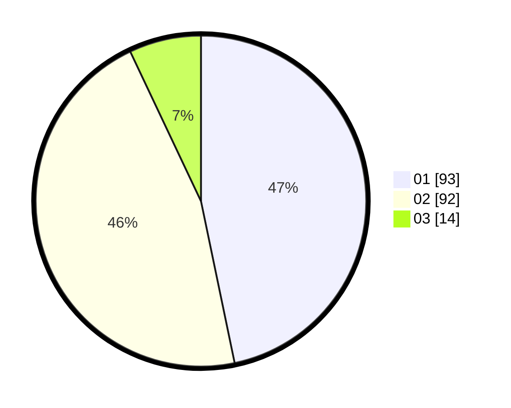

# Hasil

Hasil perolehan suara paslon dapat dilihat pada file paslon-01.txt, paslon-02.txt, dan paslon-03.txt.

Jika tidak ada, artinya data tersebut belum ada pada SIREKAP.

## Perolehan Suara

 * Paslon 01: **93**.
 * Paslon 02: **92**.
 * Paslon 03: **14**.

## Foto C Plano

https://sirekap-obj-formc.kpu.go.id/320c/pemilu/ppwp/31/75/05/10/04/3175051004130-20240214-155521--2928e30c-420b-4d23-b328-e11f919246f3.jpg

https://sirekap-obj-formc.kpu.go.id/320c/pemilu/ppwp/31/75/05/10/04/3175051004130-20240214-155547--8f2c4b82-4822-438a-84f1-450240018b32.jpg

https://sirekap-obj-formc.kpu.go.id/320c/pemilu/ppwp/31/75/05/10/04/3175051004130-20240214-155554--3eac4977-9926-467a-ba49-b76c5e871bdb.jpg

## DATA PEMILIH TETAP

Jumlah pemilih dalam DPT: **258**.
 * L: **126**.
 * P: **132**.

## DATA PENGGUNA HAK PILIH

Jumlah pengguna hak pilih dalam DPT: **199**.
 * L: **90**.
 * P: **109**.

Jumlah pengguna hak pilih dalam DPTb: **1**.
 * L: **0**.
 * P: **1**.

Jumlah pengguna hak pilih dalam DPK: **0**.
 * L: **0**.
 * P: **0**.

Jumlah pengguna hak pilih: **200**.
 * L: **90**.
 * P: **110**.

## JUMLAH SUARA SAH DAN TIDAK SAH

JUMLAH SELURUH SUARA SAH: **199**.

JUMLAH SUARA TIDAK SAH: **1**.

JUMLAH SELURUH SUARA SAH DAN SUARA TIDAK SAH: **200**.
