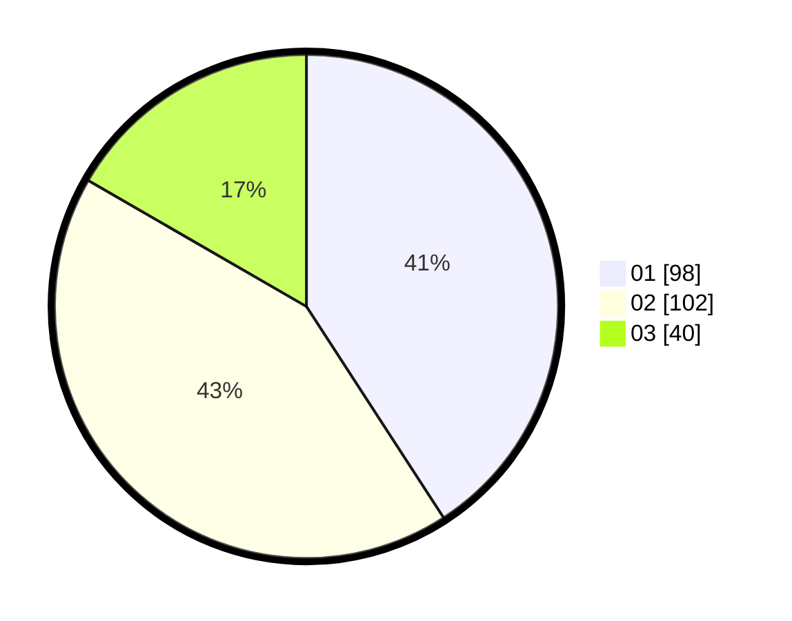

# Hasil

Hasil perolehan suara paslon dapat dilihat pada file paslon-01.txt, paslon-02.txt, dan paslon-03.txt.

Jika tidak ada, artinya data tersebut belum ada pada SIREKAP.

## Perolehan Suara

 * Paslon 01: **98**.
 * Paslon 02: **102**.
 * Paslon 03: **40**.

## Foto C Plano

https://sirekap-obj-formc.kpu.go.id/b491/pemilu/ppwp/31/75/05/10/05/3175051005007-20240214-184522--30c63aa4-b0f8-4daa-ad9b-4121830fbedf.jpg

https://sirekap-obj-formc.kpu.go.id/b491/pemilu/ppwp/31/75/05/10/05/3175051005007-20240214-184629--f7c4dfb7-abe4-4cc3-b18b-69e43d456f5d.jpg

https://sirekap-obj-formc.kpu.go.id/b491/pemilu/ppwp/31/75/05/10/05/3175051005007-20240214-184750--77b583ab-b6aa-42d0-b22c-6762eac6b4c0.jpg

## DATA PEMILIH TETAP

Jumlah pemilih dalam DPT: **279**.
 * L: **136**.
 * P: **143**.

## DATA PENGGUNA HAK PILIH

Jumlah pengguna hak pilih dalam DPT: **243**.
 * L: **118**.
 * P: **125**.

Jumlah pengguna hak pilih dalam DPTb: **2**.
 * L: **1**.
 * P: **1**.

Jumlah pengguna hak pilih dalam DPK: **0**.
 * L: **0**.
 * P: **0**.

Jumlah pengguna hak pilih: **245**.
 * L: **119**.
 * P: **126**.

## JUMLAH SUARA SAH DAN TIDAK SAH

JUMLAH SELURUH SUARA SAH: **240**.

JUMLAH SUARA TIDAK SAH: **5**.

JUMLAH SELURUH SUARA SAH DAN SUARA TIDAK SAH: **245**.
