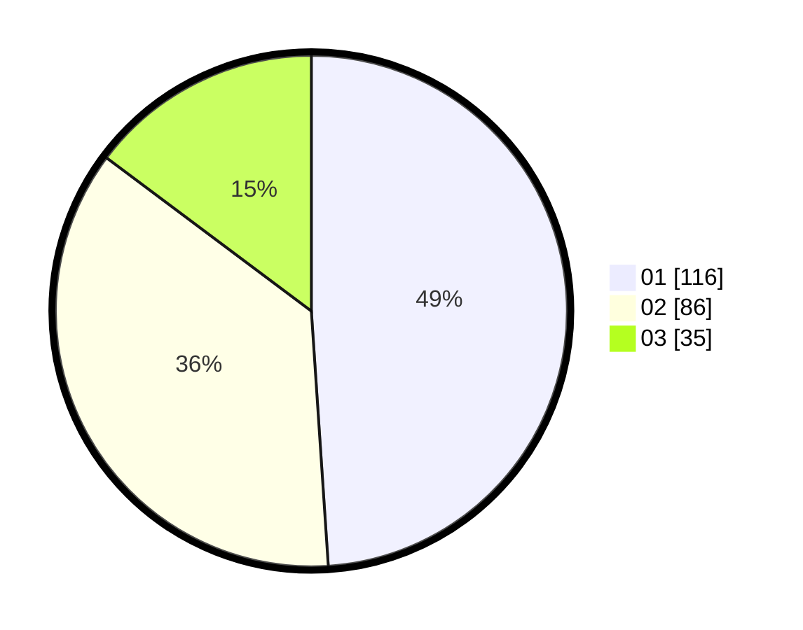

# Hasil

Hasil perolehan suara paslon dapat dilihat pada file paslon-01.txt, paslon-02.txt, dan paslon-03.txt.

Jika tidak ada, artinya data tersebut belum ada pada SIREKAP.

## Perolehan Suara

 * Paslon 01: **116**.
 * Paslon 02: **86**.
 * Paslon 03: **35**.

## Foto C Plano

https://sirekap-obj-formc.kpu.go.id/048c/pemilu/ppwp/31/75/05/10/05/3175051005014-20240214-230005--cbbc97c5-2dbd-4b44-b1f7-51a6d0a3410c.jpg

https://sirekap-obj-formc.kpu.go.id/048c/pemilu/ppwp/31/75/05/10/05/3175051005014-20240214-230144--a6236567-03d0-4be0-89cb-3318a47402da.jpg

https://sirekap-obj-formc.kpu.go.id/048c/pemilu/ppwp/31/75/05/10/05/3175051005014-20240214-230357--d47c288f-3142-47e5-a32a-c64027012441.jpg

## DATA PEMILIH TETAP

Jumlah pemilih dalam DPT: **274**.
 * L: **131**.
 * P: **143**.

## DATA PENGGUNA HAK PILIH

Jumlah pengguna hak pilih dalam DPT: **232**.
 * L: **109**.
 * P: **123**.

Jumlah pengguna hak pilih dalam DPTb: **8**.
 * L: **3**.
 * P: **5**.

Jumlah pengguna hak pilih dalam DPK: **0**.
 * L: **0**.
 * P: **0**.

Jumlah pengguna hak pilih: **240**.
 * L: **112**.
 * P: **128**.

## JUMLAH SUARA SAH DAN TIDAK SAH

JUMLAH SELURUH SUARA SAH: **237**.

JUMLAH SUARA TIDAK SAH: **3**.

JUMLAH SELURUH SUARA SAH DAN SUARA TIDAK SAH: **240**.
