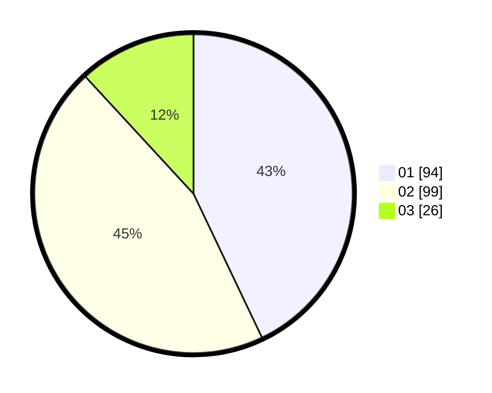

# Hasil

Hasil perolehan suara paslon dapat dilihat pada file paslon-01.txt, paslon-02.txt, dan paslon-03.txt.

Jika tidak ada, artinya data tersebut belum ada pada SIREKAP.

## Perolehan Suara

 * Paslon 01: **94**.
 * Paslon 02: **99**.
 * Paslon 03: **26**.

## Foto C Plano

https://sirekap-obj-formc.kpu.go.id/a1ed/pemilu/ppwp/31/75/05/10/05/3175051005035-20240214-193323--a538269e-be31-4abc-9774-54ec3a3650d8.jpg

https://sirekap-obj-formc.kpu.go.id/a1ed/pemilu/ppwp/31/75/05/10/05/3175051005035-20240214-193329--323ca471-b19b-4aa8-84f3-28e03cf05bee.jpg

https://sirekap-obj-formc.kpu.go.id/a1ed/pemilu/ppwp/31/75/05/10/05/3175051005035-20240215-003746--0012ccdf-065f-410f-b755-8d298d5908c8.jpg

## DATA PEMILIH TETAP

Jumlah pemilih dalam DPT: **256**.
 * L: **113**.
 * P: **143**.

## DATA PENGGUNA HAK PILIH

Jumlah pengguna hak pilih dalam DPT: **221**.
 * L: **94**.
 * P: **127**.

Jumlah pengguna hak pilih dalam DPTb: **0**.
 * L: **0**.
 * P: **0**.

Jumlah pengguna hak pilih dalam DPK: **0**.
 * L: **0**.
 * P: **0**.

Jumlah pengguna hak pilih: **221**.
 * L: **94**.
 * P: **127**.

## JUMLAH SUARA SAH DAN TIDAK SAH

JUMLAH SELURUH SUARA SAH: **219**.

JUMLAH SUARA TIDAK SAH: **2**.

JUMLAH SELURUH SUARA SAH DAN SUARA TIDAK SAH: **221**.
