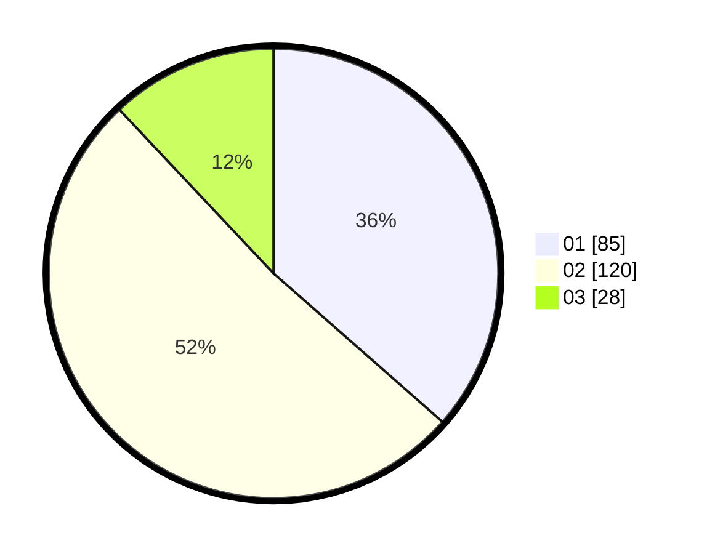

# Hasil

Hasil perolehan suara paslon dapat dilihat pada file paslon-01.txt, paslon-02.txt, dan paslon-03.txt.

Jika tidak ada, artinya data tersebut belum ada pada SIREKAP.

## Perolehan Suara

 * Paslon 01: **85**.
 * Paslon 02: **120**.
 * Paslon 03: **28**.

## Foto C Plano

https://sirekap-obj-formc.kpu.go.id/c01a/pemilu/ppwp/31/75/05/10/05/3175051005036-20240215-021036--e3af1ecd-8022-417a-8201-88b470012469.jpg

https://sirekap-obj-formc.kpu.go.id/c01a/pemilu/ppwp/31/75/05/10/05/3175051005036-20240215-024103--0381088d-dd12-4ea9-9984-011391d12deb.jpg

https://sirekap-obj-formc.kpu.go.id/c01a/pemilu/ppwp/31/75/05/10/05/3175051005036-20240215-024301--7d9904a7-621b-46a0-a9aa-09f471f0a5fa.jpg
