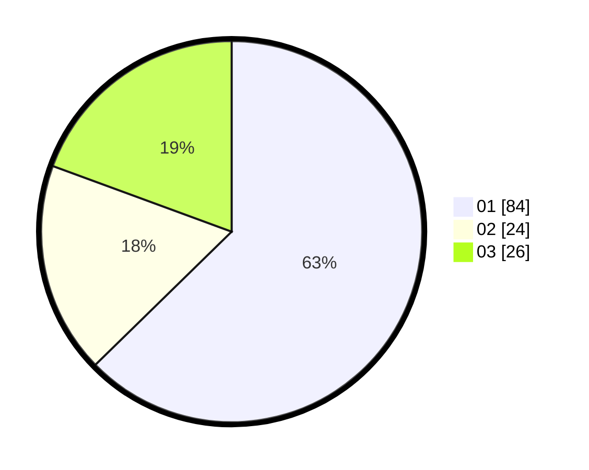

# Hasil

Hasil perolehan suara paslon dapat dilihat pada file paslon-01.txt, paslon-02.txt, dan paslon-03.txt.

Jika tidak ada, artinya data tersebut belum ada pada SIREKAP.

## Perolehan Suara

 * Paslon 01: **84**.
 * Paslon 02: **24**.
 * Paslon 03: **26**.

## Foto C Plano

https://sirekap-obj-formc.kpu.go.id/fa67/pemilu/ppwp/31/75/05/10/05/3175051005037-20240215-010758--017c98d2-a663-4ef4-ae4a-f17cceb16193.jpg

https://sirekap-obj-formc.kpu.go.id/fa67/pemilu/ppwp/31/75/05/10/05/3175051005037-20240215-010941--1e350363-0c7e-4cd5-b966-465512472cf1.jpg

https://sirekap-obj-formc.kpu.go.id/fa67/pemilu/ppwp/31/75/05/10/05/3175051005037-20240215-011050--2de96392-ebac-425b-af9c-38449ab086e7.jpg
