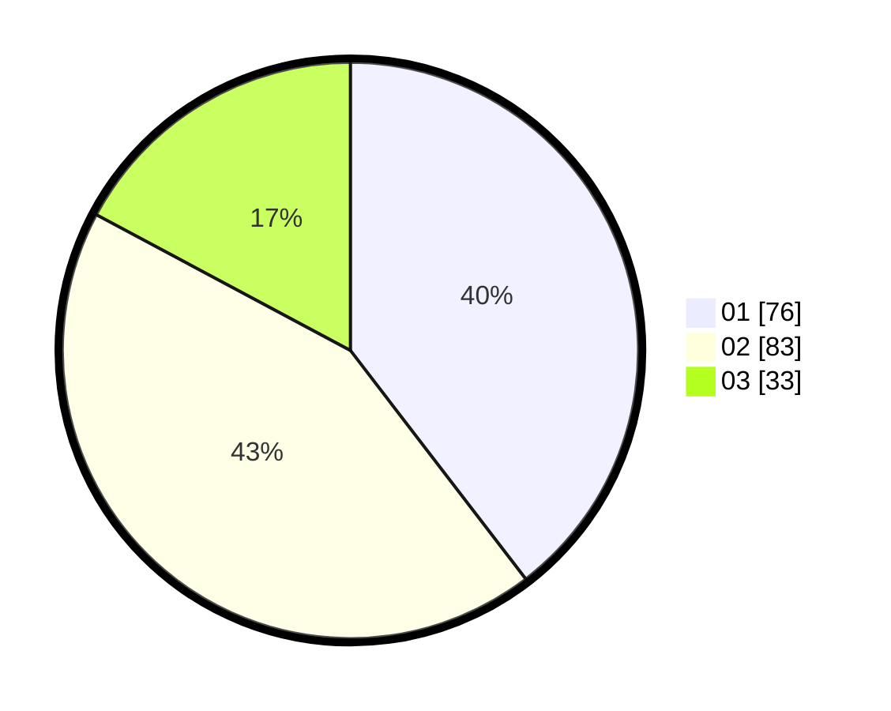

# Hasil

Hasil perolehan suara paslon dapat dilihat pada file paslon-01.txt, paslon-02.txt, dan paslon-03.txt.

Jika tidak ada, artinya data tersebut belum ada pada SIREKAP.

## Perolehan Suara

 * Paslon 01: **76**.
 * Paslon 02: **83**.
 * Paslon 03: **33**.

## Foto C Plano

https://sirekap-obj-formc.kpu.go.id/47fc/pemilu/ppwp/31/75/05/10/05/3175051005041-20240214-233826--cda74e79-59f5-4711-92c9-a1c25176fdc1.jpg

https://sirekap-obj-formc.kpu.go.id/47fc/pemilu/ppwp/31/75/05/10/05/3175051005041-20240214-233836--2e148580-167d-4ae4-ad2e-27e75d8851a4.jpg

https://sirekap-obj-formc.kpu.go.id/47fc/pemilu/ppwp/31/75/05/10/05/3175051005041-20240214-233839--9acddea2-8ad7-471f-8e02-0e853a3e6b02.jpg

## DATA PEMILIH TETAP

Jumlah pemilih dalam DPT: **296**.
 * L: **169**.
 * P: **127**.

## DATA PENGGUNA HAK PILIH

Jumlah pengguna hak pilih dalam DPT: **194**.
 * L: **94**.
 * P: **100**.

Jumlah pengguna hak pilih dalam DPTb: **0**.
 * L: **0**.
 * P: **0**.

Jumlah pengguna hak pilih dalam DPK: **2**.
 * L: **0**.
 * P: **2**.

Jumlah pengguna hak pilih: **196**.
 * L: **94**.
 * P: **102**.

## JUMLAH SUARA SAH DAN TIDAK SAH

JUMLAH SELURUH SUARA SAH: **192**.

JUMLAH SUARA TIDAK SAH: **4**.

JUMLAH SELURUH SUARA SAH DAN SUARA TIDAK SAH: **196**.
