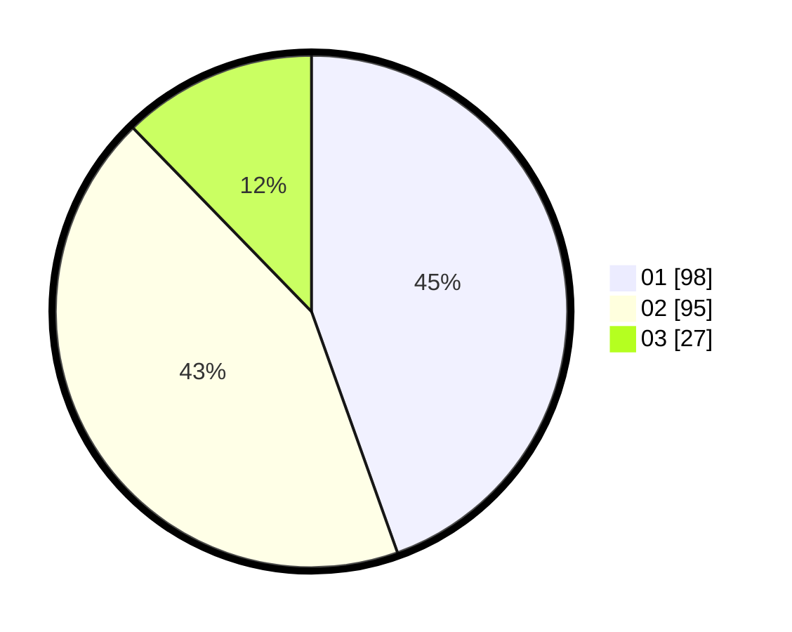

# Hasil

Hasil perolehan suara paslon dapat dilihat pada file paslon-01.txt, paslon-02.txt, dan paslon-03.txt.

Jika tidak ada, artinya data tersebut belum ada pada SIREKAP.

## Perolehan Suara

 * Paslon 01: **98**.
 * Paslon 02: **95**.
 * Paslon 03: **27**.

## Foto C Plano

https://sirekap-obj-formc.kpu.go.id/8985/pemilu/ppwp/31/75/05/10/05/3175051005042-20240215-002852--d6b1aac5-1c80-49d7-a338-6a53aef4333d.jpg

https://sirekap-obj-formc.kpu.go.id/8985/pemilu/ppwp/31/75/05/10/05/3175051005042-20240215-003041--06f76ba1-dbd2-4a86-8f9e-b728f003b022.jpg

https://sirekap-obj-formc.kpu.go.id/8985/pemilu/ppwp/31/75/05/10/05/3175051005042-20240215-003338--046e40ef-6501-40a0-ade8-7d476942ceb0.jpg

## DATA PEMILIH TETAP

Jumlah pemilih dalam DPT: **283**.
 * L: **150**.
 * P: **133**.

## DATA PENGGUNA HAK PILIH

Jumlah pengguna hak pilih dalam DPT: **218**.
 * L: **104**.
 * P: **114**.

Jumlah pengguna hak pilih dalam DPTb: **1**.
 * L: **0**.
 * P: **1**.

Jumlah pengguna hak pilih dalam DPK: **1**.
 * L: **0**.
 * P: **1**.

Jumlah pengguna hak pilih: **220**.
 * L: **104**.
 * P: **116**.

## JUMLAH SUARA SAH DAN TIDAK SAH

JUMLAH SELURUH SUARA SAH: **220**.

JUMLAH SUARA TIDAK SAH: **1**.

JUMLAH SELURUH SUARA SAH DAN SUARA TIDAK SAH: **221**.
