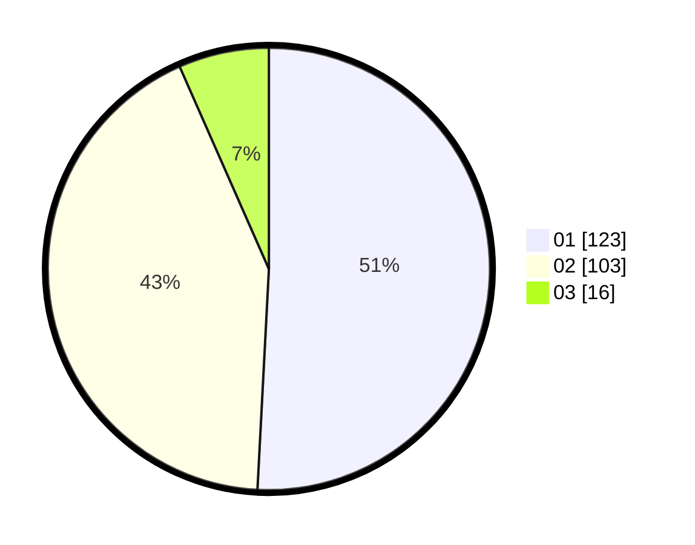

# Hasil

Hasil perolehan suara paslon dapat dilihat pada file paslon-01.txt, paslon-02.txt, dan paslon-03.txt.

Jika tidak ada, artinya data tersebut belum ada pada SIREKAP.

## Perolehan Suara

 * Paslon 01: **123**.
 * Paslon 02: **103**.
 * Paslon 03: **16**.

## Foto C Plano

https://sirekap-obj-formc.kpu.go.id/d780/pemilu/ppwp/31/75/05/10/05/3175051005047-20240214-232531--00ffa9a0-898e-4225-8e6e-680bcd0134a5.jpg

https://sirekap-obj-formc.kpu.go.id/d780/pemilu/ppwp/31/75/05/10/05/3175051005047-20240214-232554--a5535744-951a-427b-99c3-b16b762febcd.jpg

https://sirekap-obj-formc.kpu.go.id/d780/pemilu/ppwp/31/75/05/10/05/3175051005047-20240214-232558--a57b9ab2-20c5-4797-8e63-76abfa6719c7.jpg

## DATA PEMILIH TETAP

Jumlah pemilih dalam DPT: **292**.
 * L: **150**.
 * P: **142**.

## DATA PENGGUNA HAK PILIH

Jumlah pengguna hak pilih dalam DPT: **239**.
 * L: **120**.
 * P: **119**.

Jumlah pengguna hak pilih dalam DPTb: **5**.
 * L: **5**.
 * P: **0**.

Jumlah pengguna hak pilih dalam DPK: **2**.
 * L: **0**.
 * P: **2**.

Jumlah pengguna hak pilih: **246**.
 * L: **125**.
 * P: **121**.

## JUMLAH SUARA SAH DAN TIDAK SAH

JUMLAH SELURUH SUARA SAH: **242**.

JUMLAH SUARA TIDAK SAH: **4**.

JUMLAH SELURUH SUARA SAH DAN SUARA TIDAK SAH: **246**.
