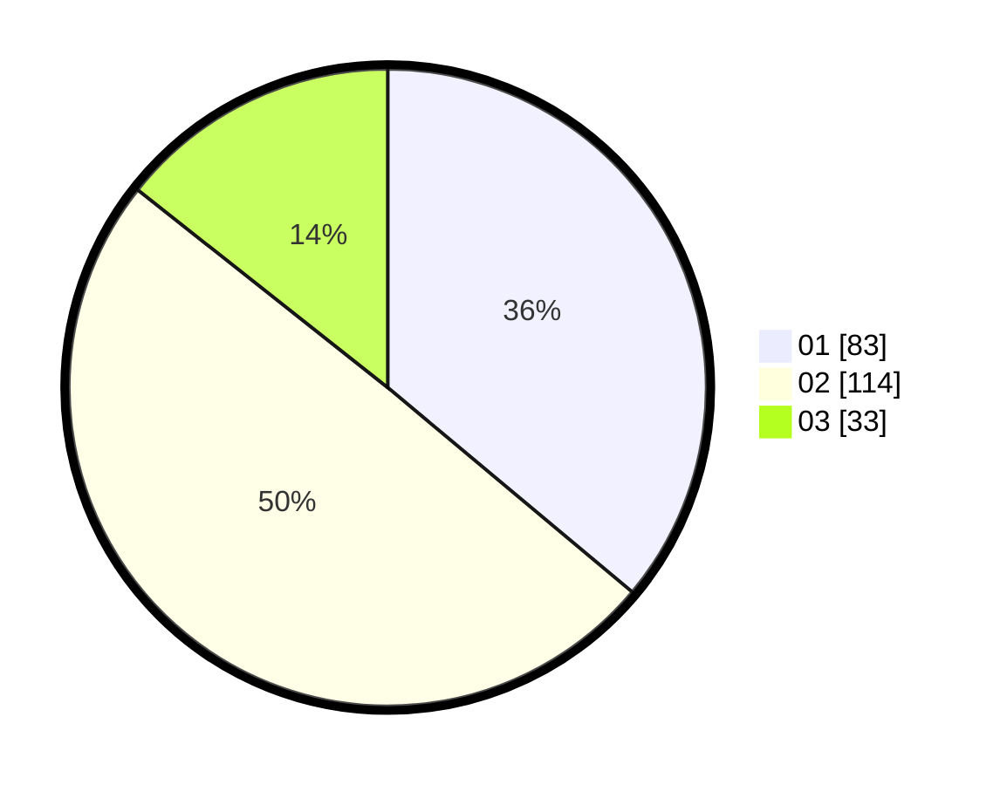

# Hasil

Hasil perolehan suara paslon dapat dilihat pada file paslon-01.txt, paslon-02.txt, dan paslon-03.txt.

Jika tidak ada, artinya data tersebut belum ada pada SIREKAP.

## Perolehan Suara

 * Paslon 01: **83**.
 * Paslon 02: **114**.
 * Paslon 03: **33**.

## Foto C Plano

https://sirekap-obj-formc.kpu.go.id/3dbe/pemilu/ppwp/31/75/05/10/05/3175051005050-20240215-000651--9183c4d5-a91e-4ca2-b3bf-40645c68446e.jpg

https://sirekap-obj-formc.kpu.go.id/3dbe/pemilu/ppwp/31/75/05/10/05/3175051005050-20240215-000656--b1aea6c1-2aed-4cfd-add8-065b25882f78.jpg

https://sirekap-obj-formc.kpu.go.id/3dbe/pemilu/ppwp/31/75/05/10/05/3175051005050-20240215-000657--ebfe0062-22c5-4460-ab97-691dabe79c4e.jpg

## DATA PEMILIH TETAP

Jumlah pemilih dalam DPT: **297**.
 * L: **142**.
 * P: **155**.

## DATA PENGGUNA HAK PILIH

Jumlah pengguna hak pilih dalam DPT: **233**.
 * L: **104**.
 * P: **129**.

Jumlah pengguna hak pilih dalam DPTb: **0**.
 * L: **0**.
 * P: **0**.

Jumlah pengguna hak pilih dalam DPK: **0**.
 * L: **0**.
 * P: **0**.

Jumlah pengguna hak pilih: **233**.
 * L: **104**.
 * P: **129**.

## JUMLAH SUARA SAH DAN TIDAK SAH

JUMLAH SELURUH SUARA SAH: **230**.

JUMLAH SUARA TIDAK SAH: **3**.

JUMLAH SELURUH SUARA SAH DAN SUARA TIDAK SAH: **233**.
