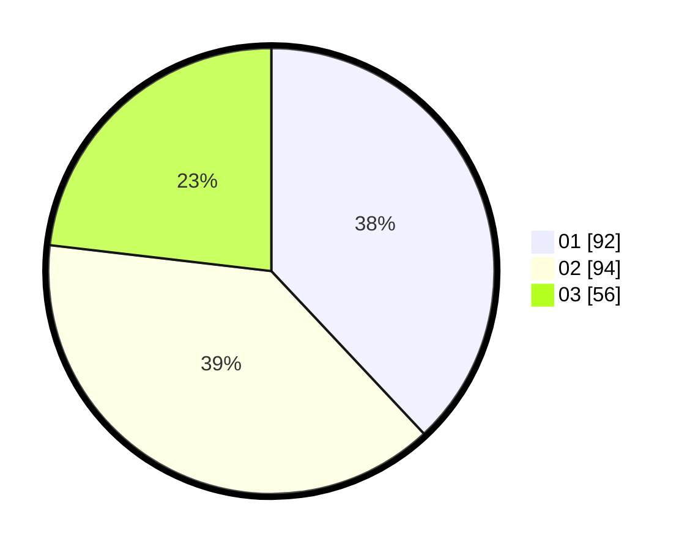

# Hasil

Hasil perolehan suara paslon dapat dilihat pada file paslon-01.txt, paslon-02.txt, dan paslon-03.txt.

Jika tidak ada, artinya data tersebut belum ada pada SIREKAP.

## Perolehan Suara

 * Paslon 01: **92**.
 * Paslon 02: **94**.
 * Paslon 03: **56**.

## Foto C Plano

https://sirekap-obj-formc.kpu.go.id/0488/pemilu/ppwp/31/75/05/10/05/3175051005054-20240214-155409--b8ed3230-a156-48a6-978d-770da718d7fe.jpg

https://sirekap-obj-formc.kpu.go.id/0488/pemilu/ppwp/31/75/05/10/05/3175051005054-20240214-155429--47ff3c2e-5d00-479c-a27c-50002c0665a4.jpg

https://sirekap-obj-formc.kpu.go.id/0488/pemilu/ppwp/31/75/05/10/05/3175051005054-20240214-155441--1c4797c5-0409-4d04-9067-89941eb5e219.jpg

## DATA PEMILIH TETAP

Jumlah pemilih dalam DPT: **205**.
 * L: **100**.
 * P: **105**.

## DATA PENGGUNA HAK PILIH

Jumlah pengguna hak pilih dalam DPT: **204**.
 * L: **100**.
 * P: **104**.

Jumlah pengguna hak pilih dalam DPTb: **1**.
 * L: **0**.
 * P: **1**.

Jumlah pengguna hak pilih dalam DPK: **0**.
 * L: **0**.
 * P: **0**.

Jumlah pengguna hak pilih: **205**.
 * L: **100**.
 * P: **105**.

## JUMLAH SUARA SAH DAN TIDAK SAH

JUMLAH SELURUH SUARA SAH: **202**.

JUMLAH SUARA TIDAK SAH: **3**.

JUMLAH SELURUH SUARA SAH DAN SUARA TIDAK SAH: **205**.
