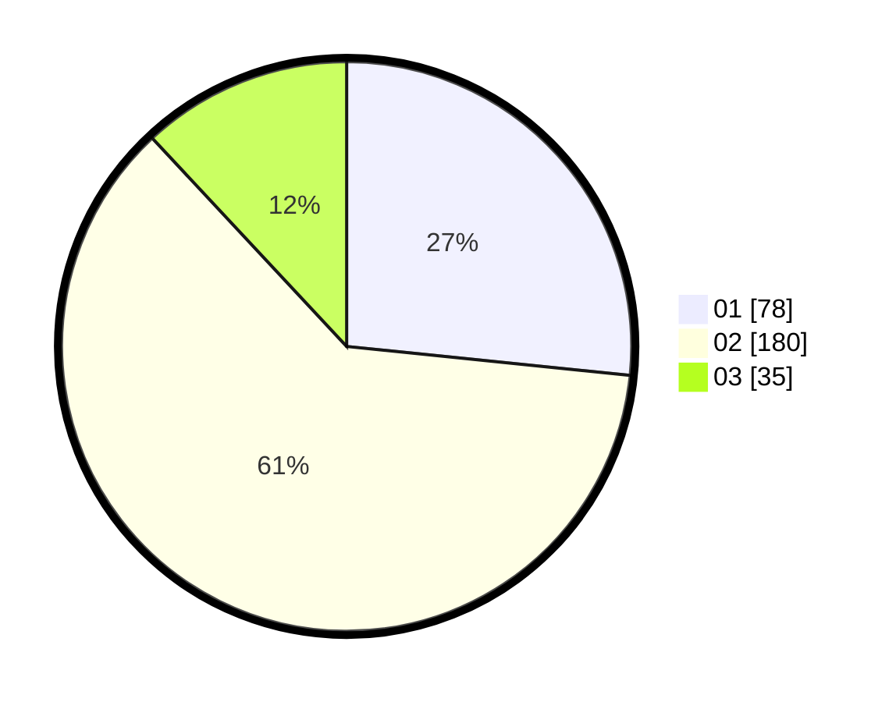

# Hasil

Hasil perolehan suara paslon dapat dilihat pada file paslon-01.txt, paslon-02.txt, dan paslon-03.txt.

Jika tidak ada, artinya data tersebut belum ada pada SIREKAP.

## Perolehan Suara

 * Paslon 01: **78**.
 * Paslon 02: **180**.
 * Paslon 03: **35**.

## Foto C Plano

https://sirekap-obj-formc.kpu.go.id/8da5/pemilu/ppwp/31/75/05/10/05/3175051005066-20240214-230354--ae08b591-29bf-4556-bfbb-4d16751541a7.jpg

https://sirekap-obj-formc.kpu.go.id/8da5/pemilu/ppwp/31/75/05/10/05/3175051005066-20240214-230423--836a0938-bedc-4951-8077-a304b612b6cf.jpg

https://sirekap-obj-formc.kpu.go.id/8da5/pemilu/ppwp/31/75/05/10/05/3175051005066-20240214-230427--a2b90323-8819-4378-a563-bf3b6737df0e.jpg

## DATA PEMILIH TETAP

Jumlah pemilih dalam DPT: **285**.
 * L: **143**.
 * P: **142**.

## DATA PENGGUNA HAK PILIH

Jumlah pengguna hak pilih dalam DPT: **238**.
 * L: **113**.
 * P: **125**.

Jumlah pengguna hak pilih dalam DPTb: **1**.
 * L: **1**.
 * P: **0**.

Jumlah pengguna hak pilih dalam DPK: **0**.
 * L: **0**.
 * P: **0**.

Jumlah pengguna hak pilih: **239**.
 * L: **114**.
 * P: **125**.

## JUMLAH SUARA SAH DAN TIDAK SAH

JUMLAH SELURUH SUARA SAH: **233**.

JUMLAH SUARA TIDAK SAH: **6**.

JUMLAH SELURUH SUARA SAH DAN SUARA TIDAK SAH: **239**.
