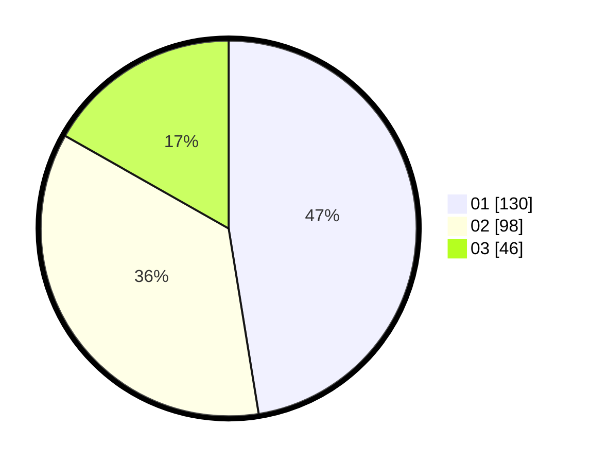

# Hasil

Hasil perolehan suara paslon dapat dilihat pada file paslon-01.txt, paslon-02.txt, dan paslon-03.txt.

Jika tidak ada, artinya data tersebut belum ada pada SIREKAP.

## Perolehan Suara

 * Paslon 01: **130**.
 * Paslon 02: **98**.
 * Paslon 03: **46**.

## Foto C Plano

https://sirekap-obj-formc.kpu.go.id/157c/pemilu/ppwp/31/75/05/10/05/3175051005083-20240215-180221--4e36f737-c47e-4730-a551-58ecce723f3e.jpg

https://sirekap-obj-formc.kpu.go.id/157c/pemilu/ppwp/31/75/05/10/05/3175051005083-20240215-215912--19662b81-d306-4973-9ba8-71f07437dfbb.jpg

https://sirekap-obj-formc.kpu.go.id/157c/pemilu/ppwp/31/75/05/10/05/3175051005083-20240215-220117--72f13f38-c486-4755-813a-ecdff3a89d3b.jpg
