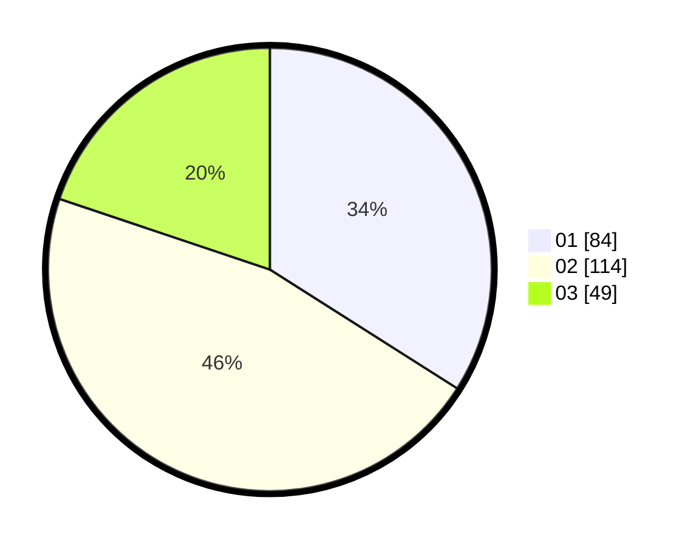

# Hasil

Hasil perolehan suara paslon dapat dilihat pada file paslon-01.txt, paslon-02.txt, dan paslon-03.txt.

Jika tidak ada, artinya data tersebut belum ada pada SIREKAP.

## Perolehan Suara

 * Paslon 01: **84**.
 * Paslon 02: **114**.
 * Paslon 03: **49**.

## Foto C Plano

https://sirekap-obj-formc.kpu.go.id/d3cf/pemilu/ppwp/31/75/05/10/05/3175051005084-20240214-212616--7dcdb9b1-54f6-4b78-bb04-4905dc31600d.jpg

https://sirekap-obj-formc.kpu.go.id/d3cf/pemilu/ppwp/31/75/05/10/05/3175051005084-20240214-212719--72f888f7-c87a-4b0e-84ff-d40a8b06d15a.jpg

https://sirekap-obj-formc.kpu.go.id/d3cf/pemilu/ppwp/31/75/05/10/05/3175051005084-20240214-212820--f9bcdd54-1f55-4182-a80b-bc9f8bf29fb3.jpg

## DATA PEMILIH TETAP

Jumlah pemilih dalam DPT: **291**.
 * L: **147**.
 * P: **144**.

## DATA PENGGUNA HAK PILIH

Jumlah pengguna hak pilih dalam DPT: **244**.
 * L: **116**.
 * P: **128**.

Jumlah pengguna hak pilih dalam DPTb: **3**.
 * L: **1**.
 * P: **2**.

Jumlah pengguna hak pilih dalam DPK: **3**.
 * L: **1**.
 * P: **2**.

Jumlah pengguna hak pilih: **250**.
 * L: **118**.
 * P: **132**.

## JUMLAH SUARA SAH DAN TIDAK SAH

JUMLAH SELURUH SUARA SAH: **247**.

JUMLAH SUARA TIDAK SAH: **3**.

JUMLAH SELURUH SUARA SAH DAN SUARA TIDAK SAH: **250**.
