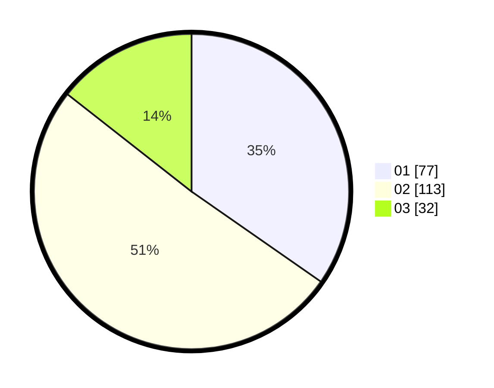

# Hasil

Hasil perolehan suara paslon dapat dilihat pada file paslon-01.txt, paslon-02.txt, dan paslon-03.txt.

Jika tidak ada, artinya data tersebut belum ada pada SIREKAP.

## Perolehan Suara

 * Paslon 01: **77**.
 * Paslon 02: **113**.
 * Paslon 03: **32**.

## Foto C Plano

https://sirekap-obj-formc.kpu.go.id/80cc/pemilu/ppwp/31/75/05/10/05/3175051005089-20240215-154302--e6b4fe00-768a-407c-9036-20cee5055e72.jpg

https://sirekap-obj-formc.kpu.go.id/80cc/pemilu/ppwp/31/75/05/10/05/3175051005089-20240214-155836--e5086770-b200-45e9-862c-b68cbea9047e.jpg

https://sirekap-obj-formc.kpu.go.id/80cc/pemilu/ppwp/31/75/05/10/05/3175051005089-20240214-155901--2994f715-750f-4af6-ad99-5ec39fd20cd8.jpg

## DATA PEMILIH TETAP

Jumlah pemilih dalam DPT: **270**.
 * L: **134**.
 * P: **136**.

## DATA PENGGUNA HAK PILIH

Jumlah pengguna hak pilih dalam DPT: **213**.
 * L: **101**.
 * P: **112**.

Jumlah pengguna hak pilih dalam DPTb: **2**.
 * L: **1**.
 * P: **1**.

Jumlah pengguna hak pilih dalam DPK: **9**.
 * L: **3**.
 * P: **6**.

Jumlah pengguna hak pilih: **224**.
 * L: **105**.
 * P: **119**.

## JUMLAH SUARA SAH DAN TIDAK SAH

JUMLAH SELURUH SUARA SAH: **222**.

JUMLAH SUARA TIDAK SAH: **2**.

JUMLAH SELURUH SUARA SAH DAN SUARA TIDAK SAH: **224**.
