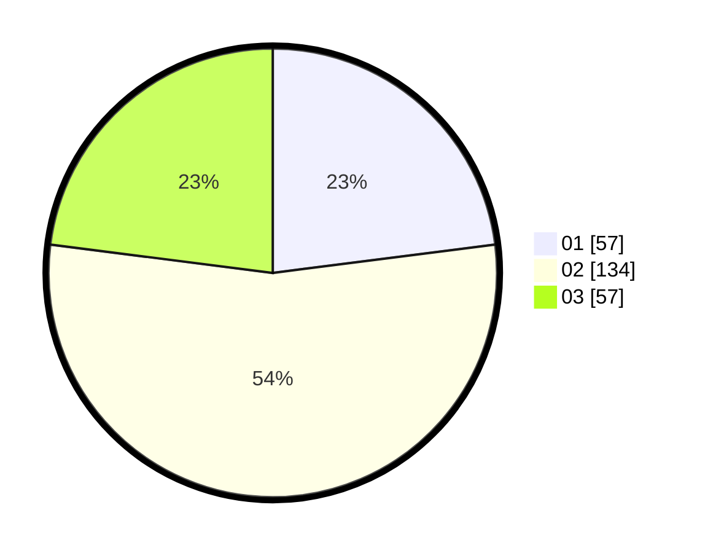

# Hasil

Hasil perolehan suara paslon dapat dilihat pada file paslon-01.txt, paslon-02.txt, dan paslon-03.txt.

Jika tidak ada, artinya data tersebut belum ada pada SIREKAP.

## Perolehan Suara

 * Paslon 01: **57**.
 * Paslon 02: **134**.
 * Paslon 03: **57**.

## Foto C Plano

https://sirekap-obj-formc.kpu.go.id/2ecc/pemilu/ppwp/31/75/05/10/05/3175051005092-20240215-022014--786ce37e-2db8-4a78-827d-8a4d1ed1ce1d.jpg

https://sirekap-obj-formc.kpu.go.id/2ecc/pemilu/ppwp/31/75/05/10/05/3175051005092-20240215-022020--d8763812-1d1a-4689-b438-47b9672e4f33.jpg

https://sirekap-obj-formc.kpu.go.id/2ecc/pemilu/ppwp/31/75/05/10/05/3175051005092-20240215-022026--a3e4d941-cdaa-47ae-aae4-61434d74dad9.jpg
