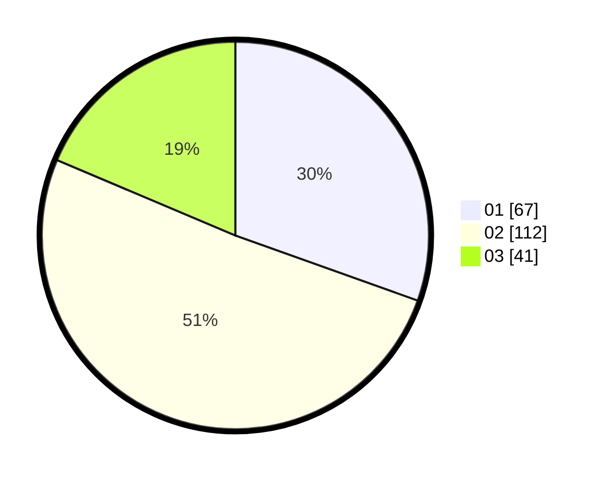

# Hasil

Hasil perolehan suara paslon dapat dilihat pada file paslon-01.txt, paslon-02.txt, dan paslon-03.txt.

Jika tidak ada, artinya data tersebut belum ada pada SIREKAP.

## Perolehan Suara

 * Paslon 01: **67**.
 * Paslon 02: **112**.
 * Paslon 03: **41**.

## Foto C Plano

https://sirekap-obj-formc.kpu.go.id/ba13/pemilu/ppwp/31/75/05/10/05/3175051005099-20240214-190836--6bab13b8-30ec-4b8c-965b-54b9acbd2d0d.jpg

https://sirekap-obj-formc.kpu.go.id/ba13/pemilu/ppwp/31/75/05/10/05/3175051005099-20240214-190858--b6b819a3-62ad-4765-9a39-23ed98762edf.jpg

https://sirekap-obj-formc.kpu.go.id/ba13/pemilu/ppwp/31/75/05/10/05/3175051005099-20240214-190847--6b5b263f-413f-4ed1-a02d-e636a67779a8.jpg

## DATA PEMILIH TETAP

Jumlah pemilih dalam DPT: **0**.
 * L: **0**.
 * P: **0**.

## DATA PENGGUNA HAK PILIH

Jumlah pengguna hak pilih dalam DPT: **0**.
 * L: **0**.
 * P: **0**.

Jumlah pengguna hak pilih dalam DPTb: **0**.
 * L: **0**.
 * P: **0**.

Jumlah pengguna hak pilih dalam DPK: **0**.
 * L: **0**.
 * P: **0**.

Jumlah pengguna hak pilih: **0**.
 * L: **0**.
 * P: **0**.

## JUMLAH SUARA SAH DAN TIDAK SAH

JUMLAH SELURUH SUARA SAH: **220**.

JUMLAH SUARA TIDAK SAH: **2**.

JUMLAH SELURUH SUARA SAH DAN SUARA TIDAK SAH: **222**.
