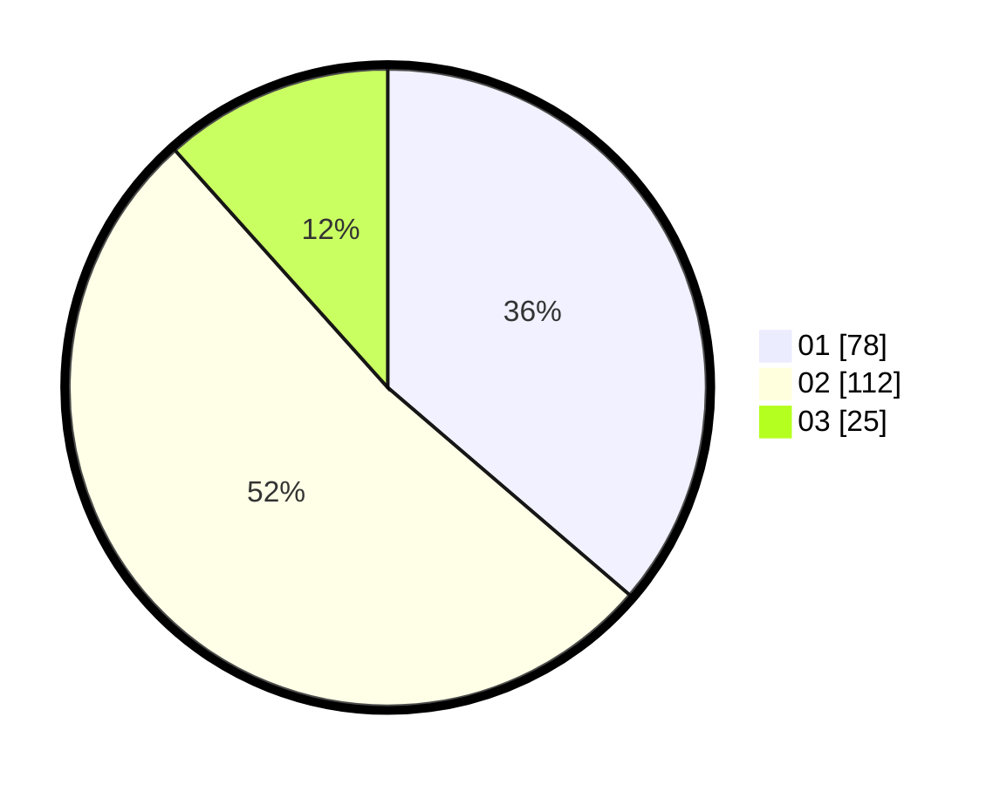

# Hasil

Hasil perolehan suara paslon dapat dilihat pada file paslon-01.txt, paslon-02.txt, dan paslon-03.txt.

Jika tidak ada, artinya data tersebut belum ada pada SIREKAP.

## Perolehan Suara

 * Paslon 01: **78**.
 * Paslon 02: **112**.
 * Paslon 03: **25**.

## Foto C Plano

https://sirekap-obj-formc.kpu.go.id/c25e/pemilu/ppwp/31/75/05/10/05/3175051005101-20240215-010911--41c3892d-3e45-47ca-b028-910ceb008aed.jpg

https://sirekap-obj-formc.kpu.go.id/c25e/pemilu/ppwp/31/75/05/10/05/3175051005101-20240215-011120--8a9ef0ff-4db6-4315-a631-82fb8c64c86e.jpg
