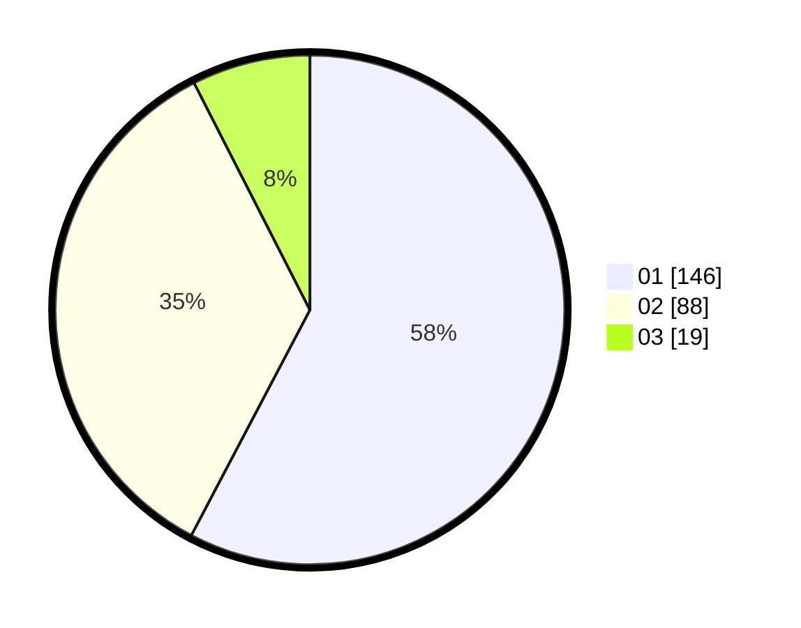

# Hasil

Hasil perolehan suara paslon dapat dilihat pada file paslon-01.txt, paslon-02.txt, dan paslon-03.txt.

Jika tidak ada, artinya data tersebut belum ada pada SIREKAP.

## Perolehan Suara

 * Paslon 01: **146**.
 * Paslon 02: **88**.
 * Paslon 03: **19**.

## Foto C Plano

https://sirekap-obj-formc.kpu.go.id/67d1/pemilu/ppwp/31/75/05/10/05/3175051005106-20240214-202735--d42a365c-14cd-4a1d-a738-4c16e376b052.jpg

https://sirekap-obj-formc.kpu.go.id/67d1/pemilu/ppwp/31/75/05/10/05/3175051005106-20240214-202940--449ceb7a-2be6-4605-88cc-03c97d4829c7.jpg

https://sirekap-obj-formc.kpu.go.id/67d1/pemilu/ppwp/31/75/05/10/05/3175051005106-20240214-203023--53031a23-bbc0-4cb5-b590-18d48c38333a.jpg

## DATA PEMILIH TETAP

Jumlah pemilih dalam DPT: **285**.
 * L: **138**.
 * P: **147**.

## DATA PENGGUNA HAK PILIH

Jumlah pengguna hak pilih dalam DPT: **248**.
 * L: **117**.
 * P: **131**.

Jumlah pengguna hak pilih dalam DPTb: **1**.
 * L: **0**.
 * P: **1**.

Jumlah pengguna hak pilih dalam DPK: **5**.
 * L: **2**.
 * P: **3**.

Jumlah pengguna hak pilih: **254**.
 * L: **119**.
 * P: **135**.

## JUMLAH SUARA SAH DAN TIDAK SAH

JUMLAH SELURUH SUARA SAH: **253**.

JUMLAH SUARA TIDAK SAH: **1**.

JUMLAH SELURUH SUARA SAH DAN SUARA TIDAK SAH: **254**.
