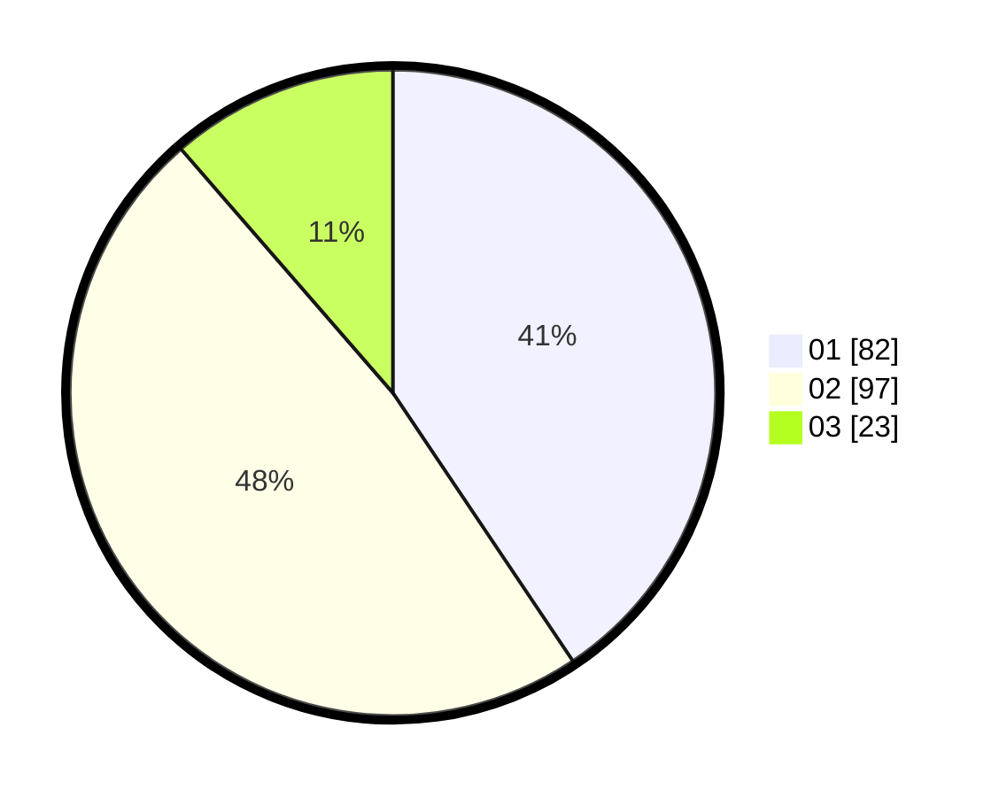

# Hasil

Hasil perolehan suara paslon dapat dilihat pada file paslon-01.txt, paslon-02.txt, dan paslon-03.txt.

Jika tidak ada, artinya data tersebut belum ada pada SIREKAP.

## Perolehan Suara

 * Paslon 01: **82**.
 * Paslon 02: **97**.
 * Paslon 03: **23**.

## Foto C Plano

https://sirekap-obj-formc.kpu.go.id/fc37/pemilu/ppwp/31/75/05/10/05/3175051005108-20240215-002042--62d62aa7-589b-49b7-a577-004e87cefa4f.jpg

https://sirekap-obj-formc.kpu.go.id/fc37/pemilu/ppwp/31/75/05/10/05/3175051005108-20240215-002058--a1675eb2-8896-4879-9713-c35e82e458db.jpg

https://sirekap-obj-formc.kpu.go.id/fc37/pemilu/ppwp/31/75/05/10/05/3175051005108-20240214-223823--d4986220-5945-4044-b593-e874de01e374.jpg
