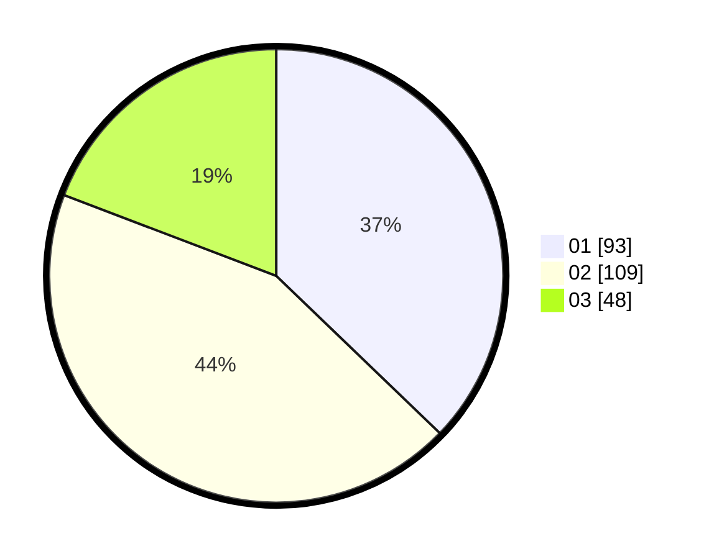

# Hasil

Hasil perolehan suara paslon dapat dilihat pada file paslon-01.txt, paslon-02.txt, dan paslon-03.txt.

Jika tidak ada, artinya data tersebut belum ada pada SIREKAP.

## Perolehan Suara

 * Paslon 01: **93**.
 * Paslon 02: **109**.
 * Paslon 03: **48**.

## Foto C Plano

https://sirekap-obj-formc.kpu.go.id/0787/pemilu/ppwp/31/75/05/10/05/3175051005123-20240215-022818--4555dbbe-c0e4-4a86-abbf-8c5b1a451fb9.jpg

https://sirekap-obj-formc.kpu.go.id/0787/pemilu/ppwp/31/75/05/10/05/3175051005123-20240215-061459--ee51425e-8caf-41df-a15e-ecaa94e7683d.jpg

https://sirekap-obj-formc.kpu.go.id/0787/pemilu/ppwp/31/75/05/10/05/3175051005123-20240215-023019--1f3ae00f-aaaf-431a-bacd-24dbeb88a61b.jpg
