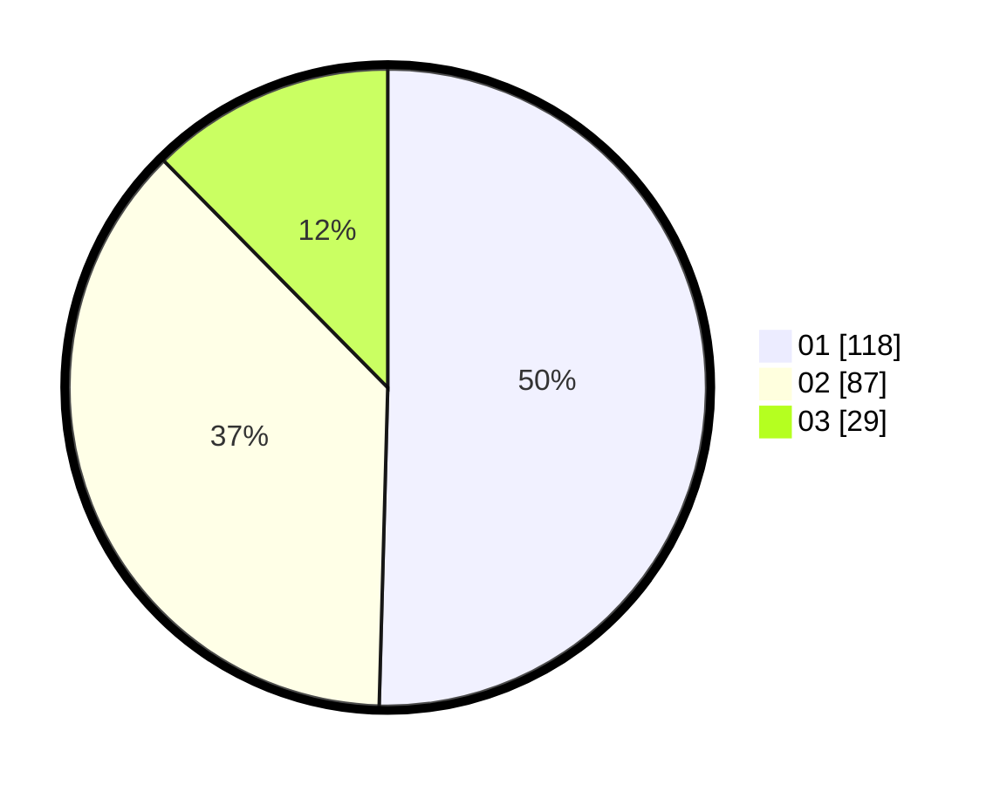

# Hasil

Hasil perolehan suara paslon dapat dilihat pada file paslon-01.txt, paslon-02.txt, dan paslon-03.txt.

Jika tidak ada, artinya data tersebut belum ada pada SIREKAP.

## Perolehan Suara

 * Paslon 01: **118**.
 * Paslon 02: **87**.
 * Paslon 03: **29**.

## Foto C Plano

https://sirekap-obj-formc.kpu.go.id/9e4e/pemilu/ppwp/31/75/05/10/05/3175051005124-20240214-215223--229181c5-fb16-4cec-b093-3f3cdce5825f.jpg

https://sirekap-obj-formc.kpu.go.id/9e4e/pemilu/ppwp/31/75/05/10/05/3175051005124-20240214-215241--58832400-c648-4eb2-9de3-b08e3c84e344.jpg

https://sirekap-obj-formc.kpu.go.id/9e4e/pemilu/ppwp/31/75/05/10/05/3175051005124-20240214-215259--57370f8e-e568-4209-ba5e-6bfdc99017fe.jpg
