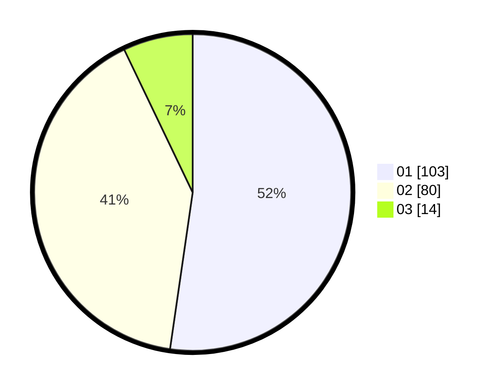

# Hasil

Hasil perolehan suara paslon dapat dilihat pada file paslon-01.txt, paslon-02.txt, dan paslon-03.txt.

Jika tidak ada, artinya data tersebut belum ada pada SIREKAP.

## Perolehan Suara

 * Paslon 01: **103**.
 * Paslon 02: **80**.
 * Paslon 03: **14**.

## Foto C Plano

https://sirekap-obj-formc.kpu.go.id/1042/pemilu/ppwp/31/75/06/10/01/3175061001001-20240214-232727--d23d1679-2ea0-48da-9f6d-19da453e41da.jpg

https://sirekap-obj-formc.kpu.go.id/1042/pemilu/ppwp/31/75/06/10/01/3175061001001-20240214-232707--ee5840d9-2561-4eeb-9324-58b192470629.jpg

https://sirekap-obj-formc.kpu.go.id/1042/pemilu/ppwp/31/75/06/10/01/3175061001001-20240214-232859--c2bbd7ca-8e62-4a16-9270-2b02f8bab6dc.jpg
