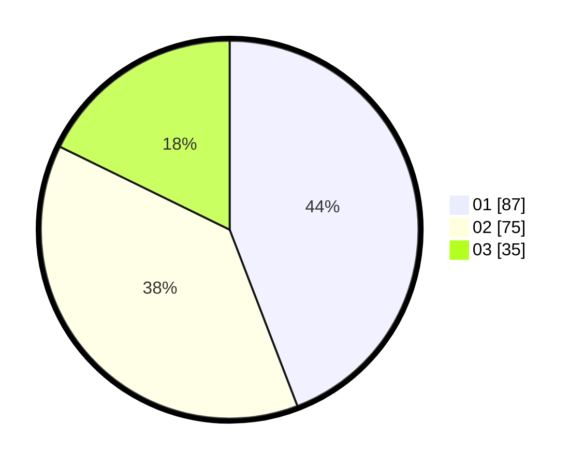

# Hasil

Hasil perolehan suara paslon dapat dilihat pada file paslon-01.txt, paslon-02.txt, dan paslon-03.txt.

Jika tidak ada, artinya data tersebut belum ada pada SIREKAP.

## Perolehan Suara

 * Paslon 01: **87**.
 * Paslon 02: **75**.
 * Paslon 03: **35**.

## Foto C Plano

https://sirekap-obj-formc.kpu.go.id/0ef3/pemilu/ppwp/31/75/06/10/01/3175061001002-20240216-152656--7e5f4ea7-62d9-47d7-9688-392644dafce4.jpg

https://sirekap-obj-formc.kpu.go.id/0ef3/pemilu/ppwp/31/75/06/10/01/3175061001002-20240216-152756--97d79133-64f8-4bd5-8274-c9d039e37ab8.jpg

https://sirekap-obj-formc.kpu.go.id/0ef3/pemilu/ppwp/31/75/06/10/01/3175061001002-20240216-152827--3d8dbaf8-7c0e-4279-89c9-1f6f217f8964.jpg

## DATA PEMILIH TETAP

Jumlah pemilih dalam DPT: **275**.
 * L: **140**.
 * P: **135**.

## DATA PENGGUNA HAK PILIH

Jumlah pengguna hak pilih dalam DPT: **202**.
 * L: **96**.
 * P: **106**.

Jumlah pengguna hak pilih dalam DPTb: **0**.
 * L: **0**.
 * P: **0**.

Jumlah pengguna hak pilih dalam DPK: **0**.
 * L: **0**.
 * P: **0**.

Jumlah pengguna hak pilih: **202**.
 * L: **96**.
 * P: **106**.

## JUMLAH SUARA SAH DAN TIDAK SAH

JUMLAH SELURUH SUARA SAH: **197**.

JUMLAH SUARA TIDAK SAH: **5**.

JUMLAH SELURUH SUARA SAH DAN SUARA TIDAK SAH: **202**.
