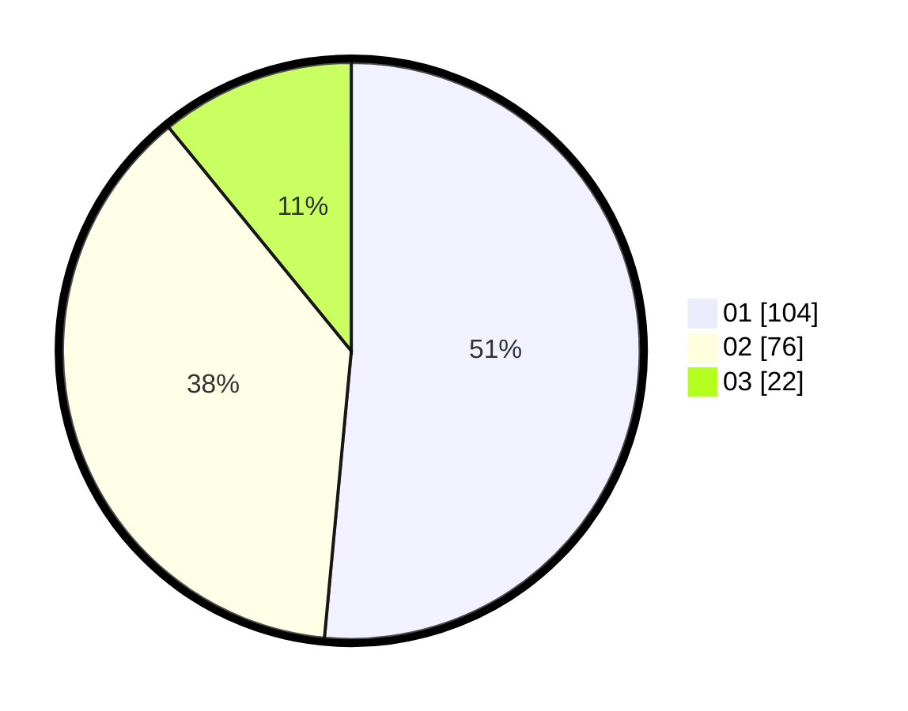

# Hasil

Hasil perolehan suara paslon dapat dilihat pada file paslon-01.txt, paslon-02.txt, dan paslon-03.txt.

Jika tidak ada, artinya data tersebut belum ada pada SIREKAP.

## Perolehan Suara

 * Paslon 01: **104**.
 * Paslon 02: **76**.
 * Paslon 03: **22**.

## Foto C Plano

https://sirekap-obj-formc.kpu.go.id/3951/pemilu/ppwp/31/75/06/10/01/3175061001003-20240214-234323--9eb4f8c6-7e2b-4452-889d-71a91f62413b.jpg

https://sirekap-obj-formc.kpu.go.id/3951/pemilu/ppwp/31/75/06/10/01/3175061001003-20240214-234753--d482417c-59cf-44ea-8ccd-3219e954d267.jpg

https://sirekap-obj-formc.kpu.go.id/3951/pemilu/ppwp/31/75/06/10/01/3175061001003-20240214-235306--2da5d397-2da4-43f8-b1bb-a4d0a789b723.jpg
