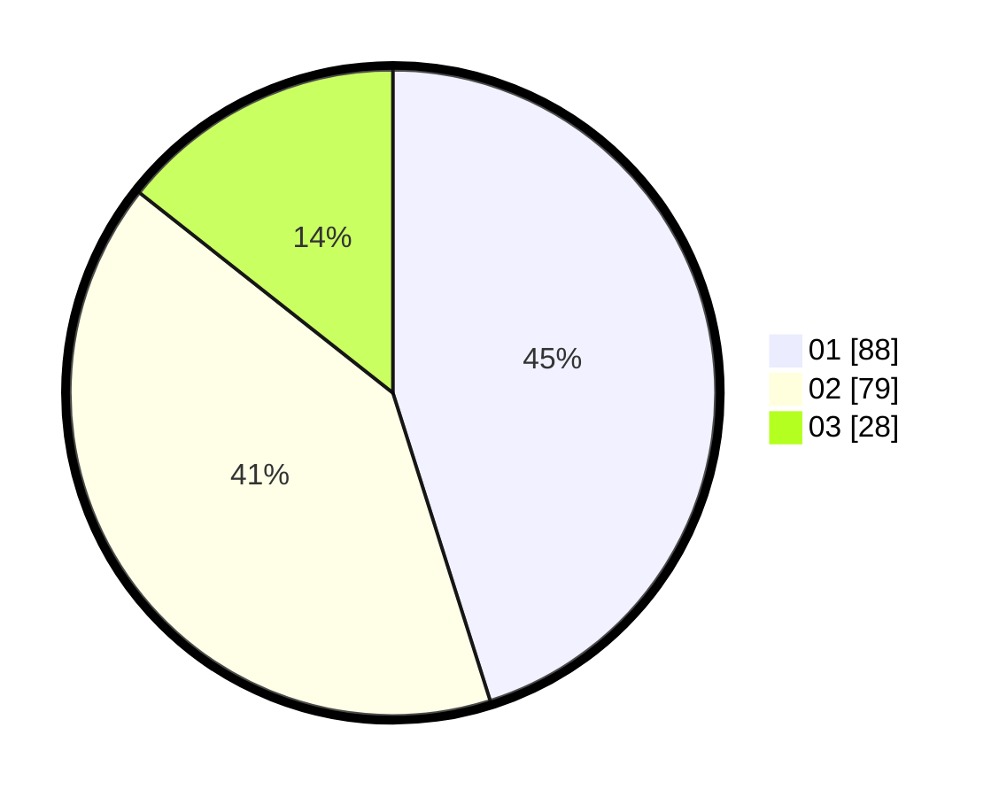

# Hasil

Hasil perolehan suara paslon dapat dilihat pada file paslon-01.txt, paslon-02.txt, dan paslon-03.txt.

Jika tidak ada, artinya data tersebut belum ada pada SIREKAP.

## Perolehan Suara

 * Paslon 01: **88**.
 * Paslon 02: **79**.
 * Paslon 03: **28**.

## Foto C Plano

https://sirekap-obj-formc.kpu.go.id/7ee7/pemilu/ppwp/31/75/06/10/01/3175061001004-20240214-205804--f5a5b394-350c-4394-b818-c999856a3ea6.jpg

https://sirekap-obj-formc.kpu.go.id/7ee7/pemilu/ppwp/31/75/06/10/01/3175061001004-20240214-205830--670e4efe-c1cb-48c3-bcb3-5f873e045163.jpg

https://sirekap-obj-formc.kpu.go.id/7ee7/pemilu/ppwp/31/75/06/10/01/3175061001004-20240214-205845--d36e4532-95fb-4b8f-8d85-2cb5a1926975.jpg
