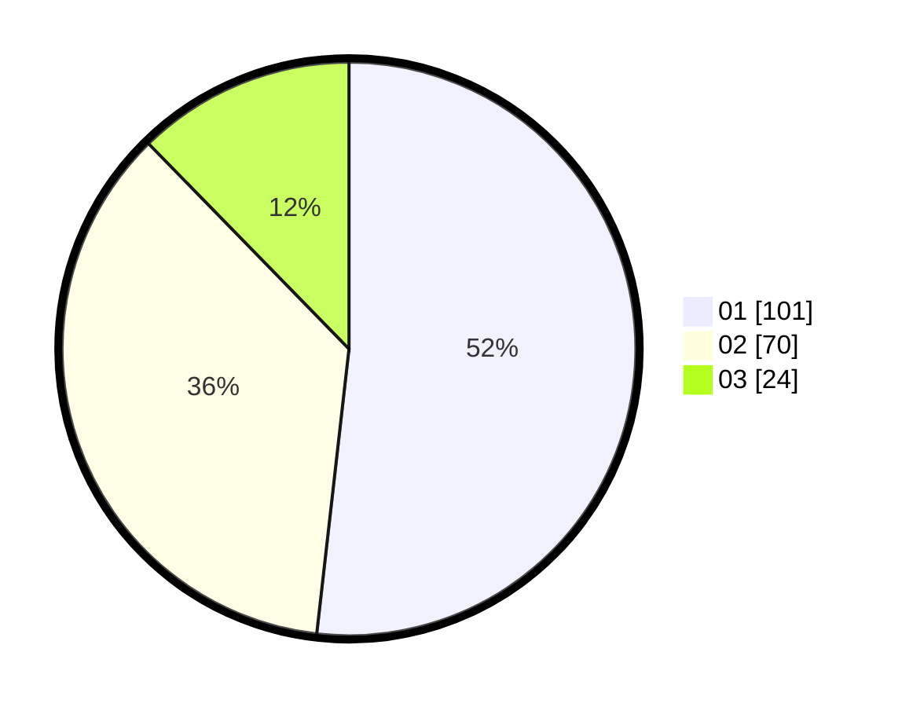

# Hasil

Hasil perolehan suara paslon dapat dilihat pada file paslon-01.txt, paslon-02.txt, dan paslon-03.txt.

Jika tidak ada, artinya data tersebut belum ada pada SIREKAP.

## Perolehan Suara

 * Paslon 01: **101**.
 * Paslon 02: **70**.
 * Paslon 03: **24**.

## Foto C Plano

https://sirekap-obj-formc.kpu.go.id/7473/pemilu/ppwp/31/75/06/10/01/3175061001008-20240215-164243--0ae0ba8f-4a68-4137-9b6f-f363642f2dec.jpg

https://sirekap-obj-formc.kpu.go.id/7473/pemilu/ppwp/31/75/06/10/01/3175061001008-20240215-164337--c50c6ae6-3556-4a03-a74f-3020f0b27715.jpg

https://sirekap-obj-formc.kpu.go.id/7473/pemilu/ppwp/31/75/06/10/01/3175061001008-20240215-164441--4ba6a5fd-e839-4fb2-a4d9-ebfb54f949db.jpg
