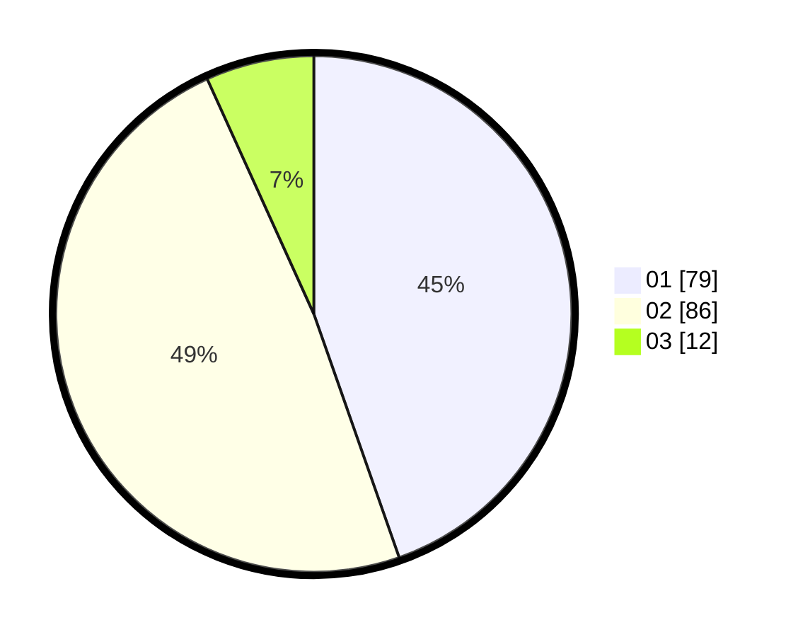

# Hasil

Hasil perolehan suara paslon dapat dilihat pada file paslon-01.txt, paslon-02.txt, dan paslon-03.txt.

Jika tidak ada, artinya data tersebut belum ada pada SIREKAP.

## Perolehan Suara

 * Paslon 01: **79**.
 * Paslon 02: **86**.
 * Paslon 03: **12**.

## Foto C Plano

https://sirekap-obj-formc.kpu.go.id/fd0e/pemilu/ppwp/31/75/06/10/01/3175061001016-20240214-212723--fe24344b-13f9-4f4b-947c-0ab436577d7b.jpg

https://sirekap-obj-formc.kpu.go.id/fd0e/pemilu/ppwp/31/75/06/10/01/3175061001016-20240214-212821--d9351b37-e129-40ba-a806-a2c45db24eb6.jpg

https://sirekap-obj-formc.kpu.go.id/fd0e/pemilu/ppwp/31/75/06/10/01/3175061001016-20240214-212911--60c7199e-5f2d-45c2-b22d-50f69c3f1014.jpg
