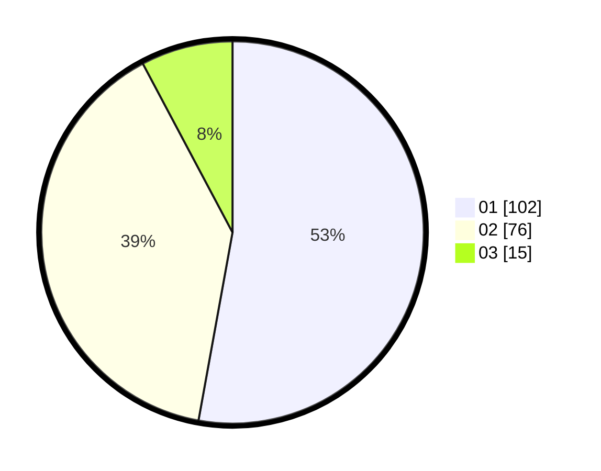

# Hasil

Hasil perolehan suara paslon dapat dilihat pada file paslon-01.txt, paslon-02.txt, dan paslon-03.txt.

Jika tidak ada, artinya data tersebut belum ada pada SIREKAP.

## Perolehan Suara

 * Paslon 01: **102**.
 * Paslon 02: **76**.
 * Paslon 03: **15**.

## Foto C Plano

https://sirekap-obj-formc.kpu.go.id/2620/pemilu/ppwp/31/75/06/10/01/3175061001023-20240218-035122--52b6f169-a961-48e3-8305-bd9c955dec0e.jpg

https://sirekap-obj-formc.kpu.go.id/2620/pemilu/ppwp/31/75/06/10/01/3175061001023-20240214-204519--cf7f2684-a34c-4edf-9b20-eedffb3e632e.jpg

https://sirekap-obj-formc.kpu.go.id/2620/pemilu/ppwp/31/75/06/10/01/3175061001023-20240214-204154--8f44ff42-a441-4f95-805e-b02b415a9d1a.jpg
