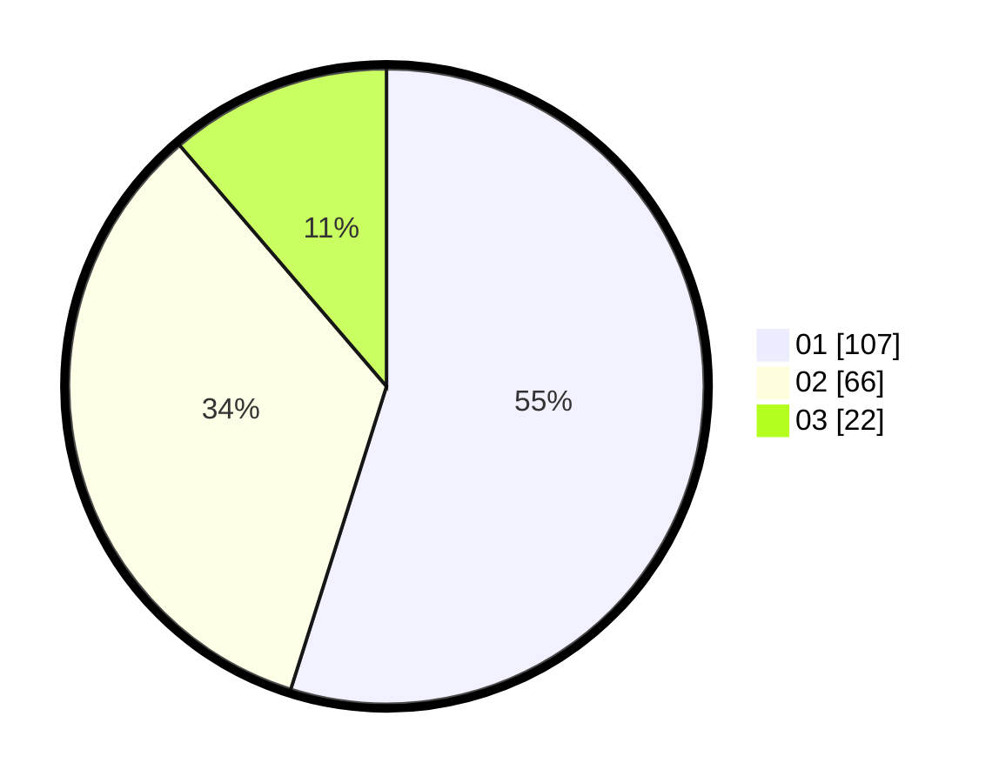

# Hasil

Hasil perolehan suara paslon dapat dilihat pada file paslon-01.txt, paslon-02.txt, dan paslon-03.txt.

Jika tidak ada, artinya data tersebut belum ada pada SIREKAP.

## Perolehan Suara

 * Paslon 01: **107**.
 * Paslon 02: **66**.
 * Paslon 03: **22**.

## Foto C Plano

https://sirekap-obj-formc.kpu.go.id/3796/pemilu/ppwp/31/75/06/10/01/3175061001030-20240214-203450--1f3bbc4e-2cc3-4192-8cff-2c3224a76b31.jpg

https://sirekap-obj-formc.kpu.go.id/3796/pemilu/ppwp/31/75/06/10/01/3175061001030-20240214-203745--17cf61a1-8a59-4c2a-8de2-354d22213544.jpg

https://sirekap-obj-formc.kpu.go.id/3796/pemilu/ppwp/31/75/06/10/01/3175061001030-20240214-203909--d1911805-9a35-4699-9ea3-5ba801474383.jpg

## DATA PEMILIH TETAP

Jumlah pemilih dalam DPT: **252**.
 * L: **138**.
 * P: **114**.

## DATA PENGGUNA HAK PILIH

Jumlah pengguna hak pilih dalam DPT: **196**.
 * L: **108**.
 * P: **88**.

Jumlah pengguna hak pilih dalam DPTb: **0**.
 * L: **0**.
 * P: **0**.

Jumlah pengguna hak pilih dalam DPK: **0**.
 * L: **0**.
 * P: **0**.

Jumlah pengguna hak pilih: **196**.
 * L: **108**.
 * P: **88**.

## JUMLAH SUARA SAH DAN TIDAK SAH

JUMLAH SELURUH SUARA SAH: **195**.

JUMLAH SUARA TIDAK SAH: **1**.

JUMLAH SELURUH SUARA SAH DAN SUARA TIDAK SAH: **196**.
