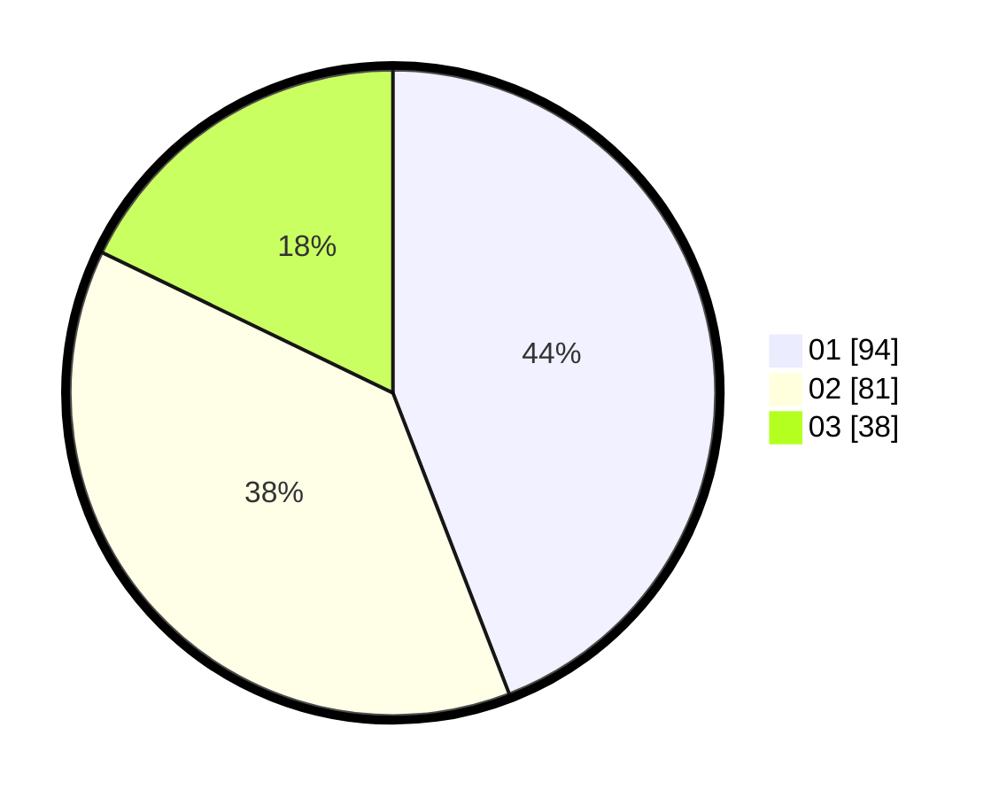

# Hasil

Hasil perolehan suara paslon dapat dilihat pada file paslon-01.txt, paslon-02.txt, dan paslon-03.txt.

Jika tidak ada, artinya data tersebut belum ada pada SIREKAP.

## Perolehan Suara

 * Paslon 01: **94**.
 * Paslon 02: **81**.
 * Paslon 03: **38**.

## Foto C Plano

https://sirekap-obj-formc.kpu.go.id/e6ee/pemilu/ppwp/31/75/06/10/01/3175061001036-20240215-195128--d3ff40ce-6333-4537-80a6-5a597e87b539.jpg

https://sirekap-obj-formc.kpu.go.id/e6ee/pemilu/ppwp/31/75/06/10/01/3175061001036-20240215-195345--e90b39ab-cd79-4f33-af2f-2b62bd87a830.jpg
