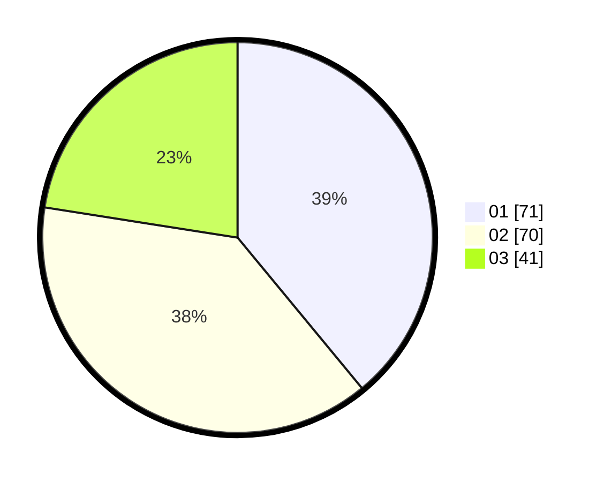

# Hasil

Hasil perolehan suara paslon dapat dilihat pada file paslon-01.txt, paslon-02.txt, dan paslon-03.txt.

Jika tidak ada, artinya data tersebut belum ada pada SIREKAP.

## Perolehan Suara

 * Paslon 01: **71**.
 * Paslon 02: **70**.
 * Paslon 03: **41**.

## Foto C Plano

https://sirekap-obj-formc.kpu.go.id/010b/pemilu/ppwp/31/75/06/10/01/3175061001043-20240214-232712--24c573c0-b595-4278-8b5e-8f8dccfff141.jpg

https://sirekap-obj-formc.kpu.go.id/010b/pemilu/ppwp/31/75/06/10/01/3175061001043-20240214-232956--43f70ecd-e34d-4a22-9817-a7c422d08cf6.jpg

https://sirekap-obj-formc.kpu.go.id/010b/pemilu/ppwp/31/75/06/10/01/3175061001043-20240214-233023--bfe25431-f84b-45e2-8016-c1390b4585c8.jpg

## DATA PEMILIH TETAP

Jumlah pemilih dalam DPT: **223**.
 * L: **104**.
 * P: **119**.

## DATA PENGGUNA HAK PILIH

Jumlah pengguna hak pilih dalam DPT: **180**.
 * L: **80**.
 * P: **100**.

Jumlah pengguna hak pilih dalam DPTb: **3**.
 * L: **2**.
 * P: **1**.

Jumlah pengguna hak pilih dalam DPK: **2**.
 * L: **0**.
 * P: **2**.

Jumlah pengguna hak pilih: **185**.
 * L: **82**.
 * P: **103**.

## JUMLAH SUARA SAH DAN TIDAK SAH

JUMLAH SELURUH SUARA SAH: **182**.

JUMLAH SUARA TIDAK SAH: **3**.

JUMLAH SELURUH SUARA SAH DAN SUARA TIDAK SAH: **185**.
