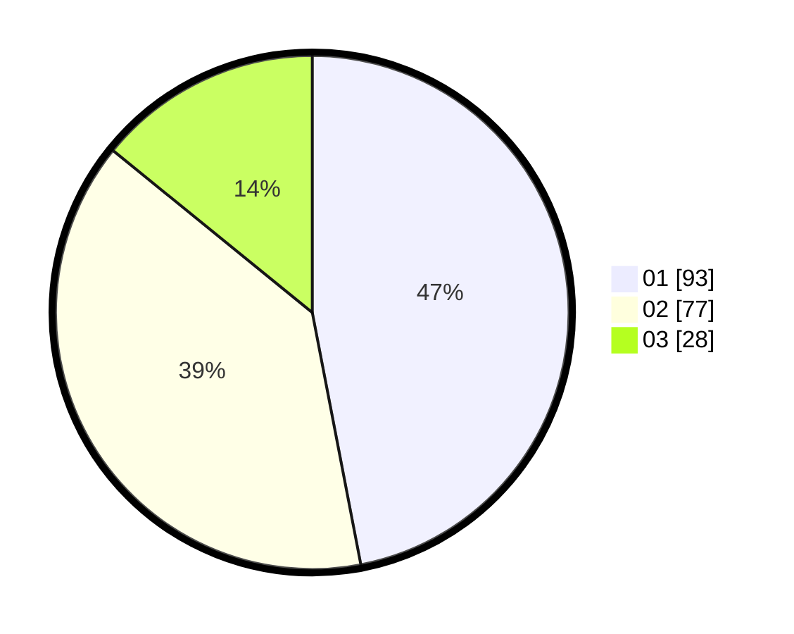

# Hasil

Hasil perolehan suara paslon dapat dilihat pada file paslon-01.txt, paslon-02.txt, dan paslon-03.txt.

Jika tidak ada, artinya data tersebut belum ada pada SIREKAP.

## Perolehan Suara

 * Paslon 01: **93**.
 * Paslon 02: **77**.
 * Paslon 03: **28**.

## Foto C Plano

https://sirekap-obj-formc.kpu.go.id/c19c/pemilu/ppwp/31/75/06/10/01/3175061001049-20240214-211642--a7fdb9da-1c16-441c-a015-1b1ded871e20.jpg

https://sirekap-obj-formc.kpu.go.id/c19c/pemilu/ppwp/31/75/06/10/01/3175061001049-20240214-212256--18a6d380-3fa3-40b2-bf48-8f87687266dd.jpg

https://sirekap-obj-formc.kpu.go.id/c19c/pemilu/ppwp/31/75/06/10/01/3175061001049-20240214-212835--b4f5344c-1905-47b5-b5d8-5406632cdfe3.jpg
