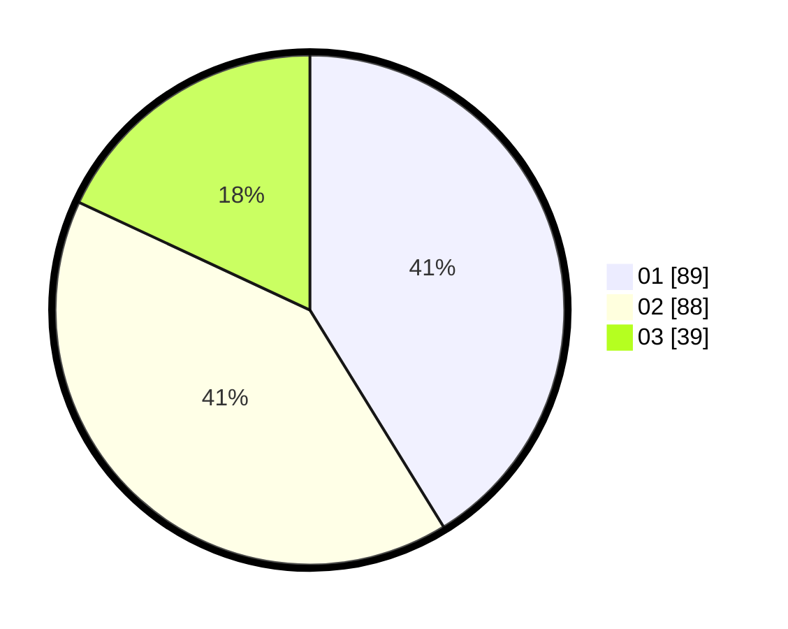

# Hasil

Hasil perolehan suara paslon dapat dilihat pada file paslon-01.txt, paslon-02.txt, dan paslon-03.txt.

Jika tidak ada, artinya data tersebut belum ada pada SIREKAP.

## Perolehan Suara

 * Paslon 01: **89**.
 * Paslon 02: **88**.
 * Paslon 03: **39**.

## Foto C Plano

https://sirekap-obj-formc.kpu.go.id/f9cc/pemilu/ppwp/31/75/06/10/01/3175061001063-20240214-221403--0a35e7ef-a14b-433b-85fe-20e73882cc6c.jpg

https://sirekap-obj-formc.kpu.go.id/f9cc/pemilu/ppwp/31/75/06/10/01/3175061001063-20240214-221408--690ec8d9-1265-44d4-8072-7b1250c2ac86.jpg

https://sirekap-obj-formc.kpu.go.id/f9cc/pemilu/ppwp/31/75/06/10/01/3175061001063-20240214-221415--6d292eab-702b-43bc-b670-48bcd4aff3e7.jpg
