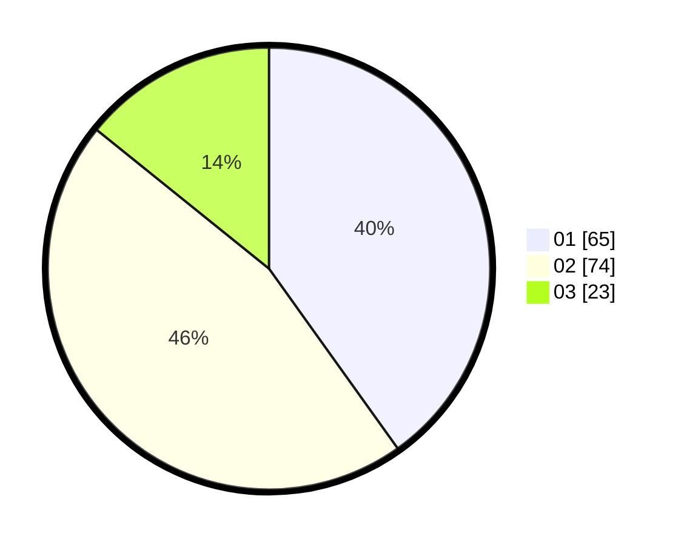

# Hasil

Hasil perolehan suara paslon dapat dilihat pada file paslon-01.txt, paslon-02.txt, dan paslon-03.txt.

Jika tidak ada, artinya data tersebut belum ada pada SIREKAP.

## Perolehan Suara

 * Paslon 01: **65**.
 * Paslon 02: **74**.
 * Paslon 03: **23**.

## Foto C Plano

https://sirekap-obj-formc.kpu.go.id/e106/pemilu/ppwp/31/75/06/10/01/3175061001071-20240215-095928--d69e800c-29b1-42ee-904f-629c5b15777e.jpg

https://sirekap-obj-formc.kpu.go.id/e106/pemilu/ppwp/31/75/06/10/01/3175061001071-20240215-100342--17732521-56a4-4a75-8cb9-4c5abc0eb079.jpg

https://sirekap-obj-formc.kpu.go.id/e106/pemilu/ppwp/31/75/06/10/01/3175061001071-20240215-100745--fd486f9c-77e1-4284-83a1-1397c938870c.jpg
