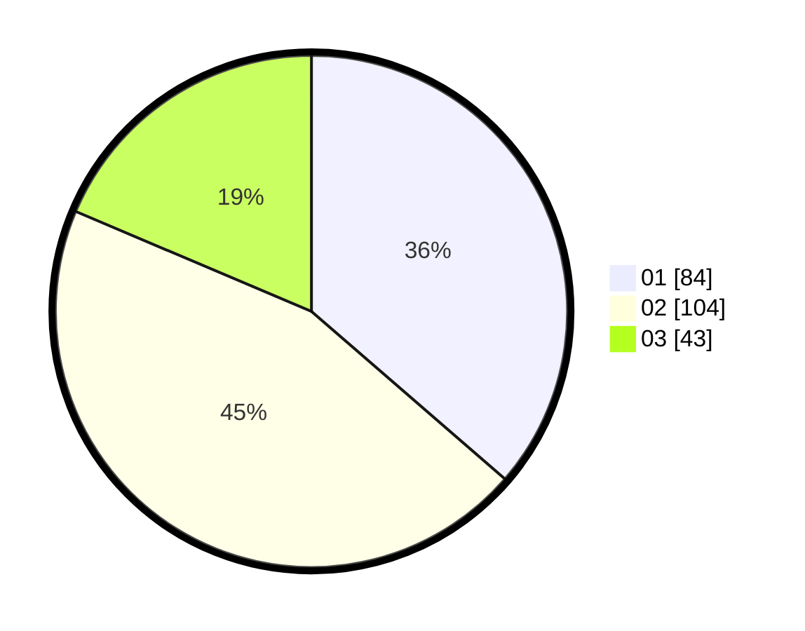

# Hasil

Hasil perolehan suara paslon dapat dilihat pada file paslon-01.txt, paslon-02.txt, dan paslon-03.txt.

Jika tidak ada, artinya data tersebut belum ada pada SIREKAP.

## Perolehan Suara

 * Paslon 01: **84**.
 * Paslon 02: **104**.
 * Paslon 03: **43**.

## Foto C Plano

https://sirekap-obj-formc.kpu.go.id/dbda/pemilu/ppwp/31/75/06/10/01/3175061001074-20240214-183111--aa0bc97e-a127-4fd2-8450-0215fd6b0c5e.jpg

https://sirekap-obj-formc.kpu.go.id/dbda/pemilu/ppwp/31/75/06/10/01/3175061001074-20240214-184800--44272a15-42dd-4ab9-8532-c5c2cec1e870.jpg

https://sirekap-obj-formc.kpu.go.id/dbda/pemilu/ppwp/31/75/06/10/01/3175061001074-20240214-185440--4fcfe99a-56cb-436e-8975-bf690ed656bb.jpg

## DATA PEMILIH TETAP

Jumlah pemilih dalam DPT: **281**.
 * L: **137**.
 * P: **144**.

## DATA PENGGUNA HAK PILIH

Jumlah pengguna hak pilih dalam DPT: **233**.
 * L: **111**.
 * P: **122**.

Jumlah pengguna hak pilih dalam DPTb: **0**.
 * L: **0**.
 * P: **0**.

Jumlah pengguna hak pilih dalam DPK: **2**.
 * L: **0**.
 * P: **2**.

Jumlah pengguna hak pilih: **235**.
 * L: **111**.
 * P: **124**.

## JUMLAH SUARA SAH DAN TIDAK SAH

JUMLAH SELURUH SUARA SAH: **235**.

JUMLAH SUARA TIDAK SAH: **4**.

JUMLAH SELURUH SUARA SAH DAN SUARA TIDAK SAH: **239**.
