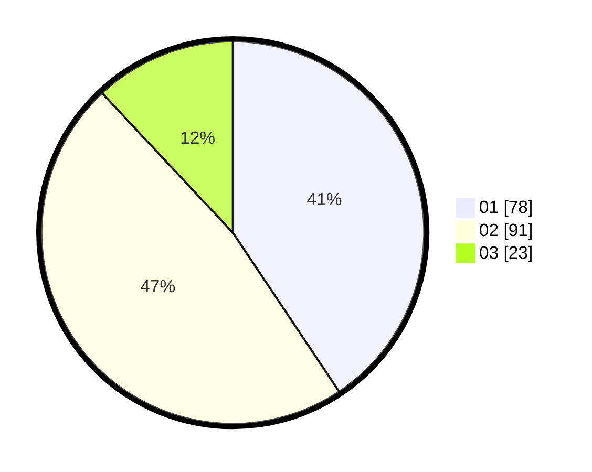

# Hasil

Hasil perolehan suara paslon dapat dilihat pada file paslon-01.txt, paslon-02.txt, dan paslon-03.txt.

Jika tidak ada, artinya data tersebut belum ada pada SIREKAP.

## Perolehan Suara

 * Paslon 01: **78**.
 * Paslon 02: **91**.
 * Paslon 03: **23**.

## Foto C Plano

https://sirekap-obj-formc.kpu.go.id/ae63/pemilu/ppwp/31/75/06/10/01/3175061001080-20240214-155926--718afb7a-5cdf-4a80-871c-dee4e9ff0b80.jpg

https://sirekap-obj-formc.kpu.go.id/ae63/pemilu/ppwp/31/75/06/10/01/3175061001080-20240214-224047--9fb8b673-ecd4-4cb8-932e-2654cc7a01dc.jpg

https://sirekap-obj-formc.kpu.go.id/ae63/pemilu/ppwp/31/75/06/10/01/3175061001080-20240214-160105--587c2934-061a-4945-a3a7-5a3f56eb8e4d.jpg

## DATA PEMILIH TETAP

Jumlah pemilih dalam DPT: **256**.
 * L: **130**.
 * P: **126**.

## DATA PENGGUNA HAK PILIH

Jumlah pengguna hak pilih dalam DPT: **187**.
 * L: **89**.
 * P: **98**.

Jumlah pengguna hak pilih dalam DPTb: **0**.
 * L: **0**.
 * P: **0**.

Jumlah pengguna hak pilih dalam DPK: **5**.
 * L: **2**.
 * P: **3**.

Jumlah pengguna hak pilih: **192**.
 * L: **91**.
 * P: **101**.

## JUMLAH SUARA SAH DAN TIDAK SAH

JUMLAH SELURUH SUARA SAH: **192**.

JUMLAH SUARA TIDAK SAH: **0**.

JUMLAH SELURUH SUARA SAH DAN SUARA TIDAK SAH: **192**.
