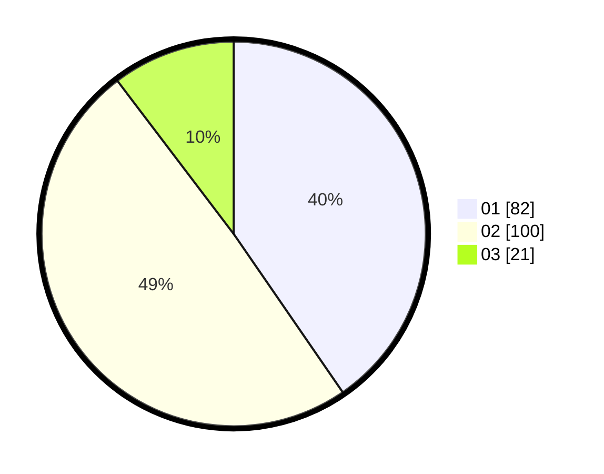

# Hasil

Hasil perolehan suara paslon dapat dilihat pada file paslon-01.txt, paslon-02.txt, dan paslon-03.txt.

Jika tidak ada, artinya data tersebut belum ada pada SIREKAP.

## Perolehan Suara

 * Paslon 01: **82**.
 * Paslon 02: **100**.
 * Paslon 03: **21**.

## Foto C Plano

https://sirekap-obj-formc.kpu.go.id/a64e/pemilu/ppwp/31/75/06/10/01/3175061001088-20240214-205200--54125308-7784-4822-9838-22737402cd2b.jpg

https://sirekap-obj-formc.kpu.go.id/a64e/pemilu/ppwp/31/75/06/10/01/3175061001088-20240214-205318--7d4d0299-ec25-4f42-8165-e3cc2f0fdd01.jpg

https://sirekap-obj-formc.kpu.go.id/a64e/pemilu/ppwp/31/75/06/10/01/3175061001088-20240214-205406--58599c59-b93d-4675-952b-a0cff2c320fe.jpg

## DATA PEMILIH TETAP

Jumlah pemilih dalam DPT: **258**.
 * L: **131**.
 * P: **127**.

## DATA PENGGUNA HAK PILIH

Jumlah pengguna hak pilih dalam DPT: **202**.
 * L: **100**.
 * P: **102**.

Jumlah pengguna hak pilih dalam DPTb: **1**.
 * L: **1**.
 * P: **0**.

Jumlah pengguna hak pilih dalam DPK: **2**.
 * L: **1**.
 * P: **1**.

Jumlah pengguna hak pilih: **205**.
 * L: **102**.
 * P: **103**.

## JUMLAH SUARA SAH DAN TIDAK SAH

JUMLAH SELURUH SUARA SAH: **203**.

JUMLAH SUARA TIDAK SAH: **2**.

JUMLAH SELURUH SUARA SAH DAN SUARA TIDAK SAH: **205**.
