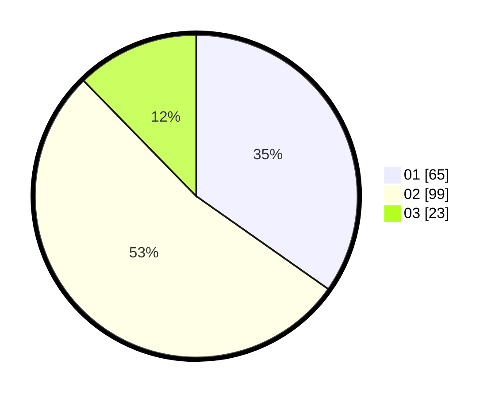

# Hasil

Hasil perolehan suara paslon dapat dilihat pada file paslon-01.txt, paslon-02.txt, dan paslon-03.txt.

Jika tidak ada, artinya data tersebut belum ada pada SIREKAP.

## Perolehan Suara

 * Paslon 01: **65**.
 * Paslon 02: **99**.
 * Paslon 03: **23**.

## Foto C Plano

https://sirekap-obj-formc.kpu.go.id/ac85/pemilu/ppwp/31/75/06/10/01/3175061001095-20240215-004929--3eb3d659-6633-470e-99e5-33b3abbe9ef2.jpg

https://sirekap-obj-formc.kpu.go.id/ac85/pemilu/ppwp/31/75/06/10/01/3175061001095-20240215-004814--2c77a2d4-731c-4e09-b095-69f854701849.jpg

https://sirekap-obj-formc.kpu.go.id/ac85/pemilu/ppwp/31/75/06/10/01/3175061001095-20240215-005032--59350d14-44e0-453d-a544-617d4ce03032.jpg
