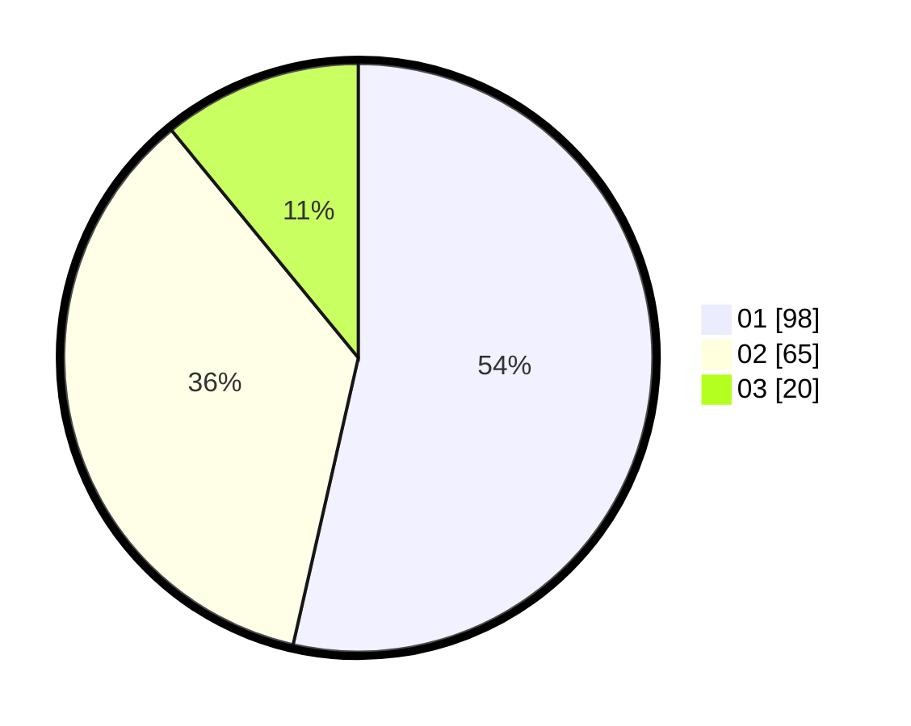

# Hasil

Hasil perolehan suara paslon dapat dilihat pada file paslon-01.txt, paslon-02.txt, dan paslon-03.txt.

Jika tidak ada, artinya data tersebut belum ada pada SIREKAP.

## Perolehan Suara

 * Paslon 01: **98**.
 * Paslon 02: **65**.
 * Paslon 03: **20**.

## Foto C Plano

https://sirekap-obj-formc.kpu.go.id/be32/pemilu/ppwp/31/75/06/10/01/3175061001096-20240214-222250--c9464459-45c6-4742-8ca9-9a62a078bbbe.jpg

https://sirekap-obj-formc.kpu.go.id/be32/pemilu/ppwp/31/75/06/10/01/3175061001096-20240214-203104--528654da-8b9b-4e20-87b4-51bf1c69fbf6.jpg

https://sirekap-obj-formc.kpu.go.id/be32/pemilu/ppwp/31/75/06/10/01/3175061001096-20240214-203223--decdc3c5-4836-4cda-8b0c-ced0a53d1379.jpg

## DATA PEMILIH TETAP

Jumlah pemilih dalam DPT: **268**.
 * L: **132**.
 * P: **136**.

## DATA PENGGUNA HAK PILIH

Jumlah pengguna hak pilih dalam DPT: **180**.
 * L: **83**.
 * P: **97**.

Jumlah pengguna hak pilih dalam DPTb: **0**.
 * L: **0**.
 * P: **0**.

Jumlah pengguna hak pilih dalam DPK: **5**.
 * L: **2**.
 * P: **3**.

Jumlah pengguna hak pilih: **185**.
 * L: **85**.
 * P: **100**.

## JUMLAH SUARA SAH DAN TIDAK SAH

JUMLAH SELURUH SUARA SAH: **183**.

JUMLAH SUARA TIDAK SAH: **2**.

JUMLAH SELURUH SUARA SAH DAN SUARA TIDAK SAH: **185**.
