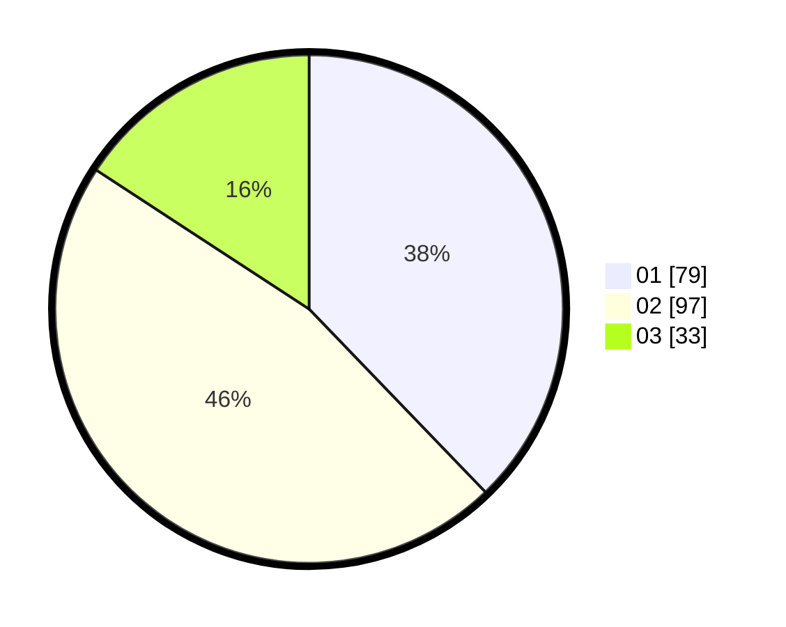

# Hasil

Hasil perolehan suara paslon dapat dilihat pada file paslon-01.txt, paslon-02.txt, dan paslon-03.txt.

Jika tidak ada, artinya data tersebut belum ada pada SIREKAP.

## Perolehan Suara

 * Paslon 01: **79**.
 * Paslon 02: **97**.
 * Paslon 03: **33**.

## Foto C Plano

https://sirekap-obj-formc.kpu.go.id/db9e/pemilu/ppwp/31/75/06/10/01/3175061001098-20240214-192217--a7ebfd3c-b5a1-4b9d-a462-42c6a1bf0654.jpg

https://sirekap-obj-formc.kpu.go.id/db9e/pemilu/ppwp/31/75/06/10/01/3175061001098-20240214-192226--bf5e2969-8677-4f9a-9d34-1d4a3355cb6f.jpg

https://sirekap-obj-formc.kpu.go.id/db9e/pemilu/ppwp/31/75/06/10/01/3175061001098-20240214-192228--219366d2-fa46-4b9d-b21d-12c3633c953c.jpg

## DATA PEMILIH TETAP

Jumlah pemilih dalam DPT: **283**.
 * L: **142**.
 * P: **141**.

## DATA PENGGUNA HAK PILIH

Jumlah pengguna hak pilih dalam DPT: **210**.
 * L: **95**.
 * P: **115**.

Jumlah pengguna hak pilih dalam DPTb: **2**.
 * L: **2**.
 * P: **0**.

Jumlah pengguna hak pilih dalam DPK: **0**.
 * L: **0**.
 * P: **0**.

Jumlah pengguna hak pilih: **212**.
 * L: **97**.
 * P: **115**.

## JUMLAH SUARA SAH DAN TIDAK SAH

JUMLAH SELURUH SUARA SAH: **209**.

JUMLAH SUARA TIDAK SAH: **3**.

JUMLAH SELURUH SUARA SAH DAN SUARA TIDAK SAH: **212**.
