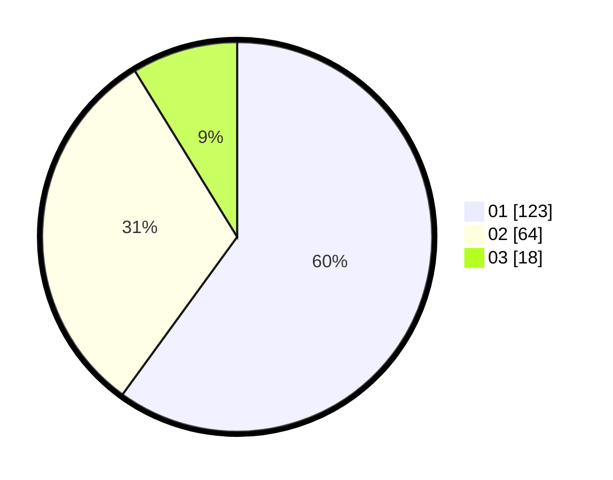

# Hasil

Hasil perolehan suara paslon dapat dilihat pada file paslon-01.txt, paslon-02.txt, dan paslon-03.txt.

Jika tidak ada, artinya data tersebut belum ada pada SIREKAP.

## Perolehan Suara

 * Paslon 01: **123**.
 * Paslon 02: **64**.
 * Paslon 03: **18**.

## Foto C Plano

https://sirekap-obj-formc.kpu.go.id/d430/pemilu/ppwp/31/75/06/10/01/3175061001100-20240219-212904--6e339924-e354-4afe-8e64-211d0a6549aa.jpg

https://sirekap-obj-formc.kpu.go.id/d430/pemilu/ppwp/31/75/06/10/01/3175061001100-20240217-131217--b71954ba-1372-46aa-b723-82720eef9b5d.jpg

https://sirekap-obj-formc.kpu.go.id/d430/pemilu/ppwp/31/75/06/10/01/3175061001100-20240217-132318--80fd4921-3f61-4ee6-b821-05f463d43658.jpg
