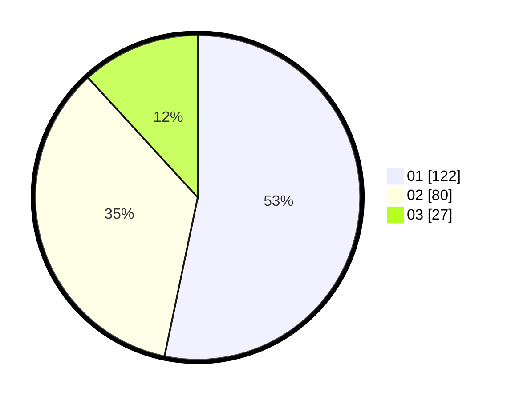

# Hasil

Hasil perolehan suara paslon dapat dilihat pada file paslon-01.txt, paslon-02.txt, dan paslon-03.txt.

Jika tidak ada, artinya data tersebut belum ada pada SIREKAP.

## Perolehan Suara

 * Paslon 01: **122**.
 * Paslon 02: **80**.
 * Paslon 03: **27**.

## Foto C Plano

https://sirekap-obj-formc.kpu.go.id/bc2c/pemilu/ppwp/31/75/06/10/01/3175061001101-20240214-233319--2f8ba933-9984-44e7-a065-221d0e72b483.jpg

https://sirekap-obj-formc.kpu.go.id/bc2c/pemilu/ppwp/31/75/06/10/01/3175061001101-20240214-233721--0e1c2160-8a47-495c-b9b4-3020623605f2.jpg

https://sirekap-obj-formc.kpu.go.id/bc2c/pemilu/ppwp/31/75/06/10/01/3175061001101-20240214-233918--ff451150-8ed1-40ce-aeab-78f80aa34b24.jpg
