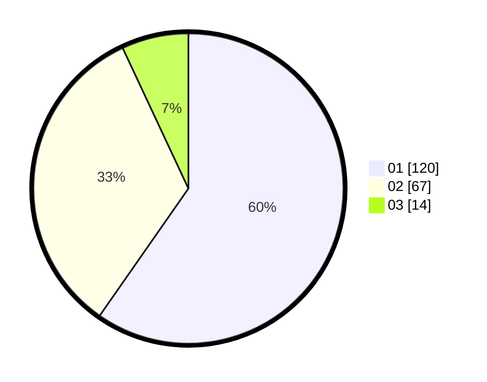

# Hasil

Hasil perolehan suara paslon dapat dilihat pada file paslon-01.txt, paslon-02.txt, dan paslon-03.txt.

Jika tidak ada, artinya data tersebut belum ada pada SIREKAP.

## Perolehan Suara

 * Paslon 01: **120**.
 * Paslon 02: **67**.
 * Paslon 03: **14**.

## Foto C Plano

https://sirekap-obj-formc.kpu.go.id/04ba/pemilu/ppwp/31/75/06/10/01/3175061001104-20240216-174324--5df3cce4-ca07-4edf-ad7c-8732e36d36a3.jpg

https://sirekap-obj-formc.kpu.go.id/04ba/pemilu/ppwp/31/75/06/10/01/3175061001104-20240216-212043--cc2222ff-ac5e-4921-bb02-9949e4dc875e.jpg

https://sirekap-obj-formc.kpu.go.id/04ba/pemilu/ppwp/31/75/06/10/01/3175061001104-20240216-213446--3b12162c-c483-4024-8b35-6233b9f0d6c2.jpg

## DATA PEMILIH TETAP

Jumlah pemilih dalam DPT: **203**.
 * L: **91**.
 * P: **112**.

## DATA PENGGUNA HAK PILIH

Jumlah pengguna hak pilih dalam DPT: **202**.
 * L: **91**.
 * P: **111**.

Jumlah pengguna hak pilih dalam DPTb: **1**.
 * L: **0**.
 * P: **1**.

Jumlah pengguna hak pilih dalam DPK: **0**.
 * L: **0**.
 * P: **0**.

Jumlah pengguna hak pilih: **203**.
 * L: **91**.
 * P: **112**.

## JUMLAH SUARA SAH DAN TIDAK SAH

JUMLAH SELURUH SUARA SAH: **201**.

JUMLAH SUARA TIDAK SAH: **2**.

JUMLAH SELURUH SUARA SAH DAN SUARA TIDAK SAH: **203**.
