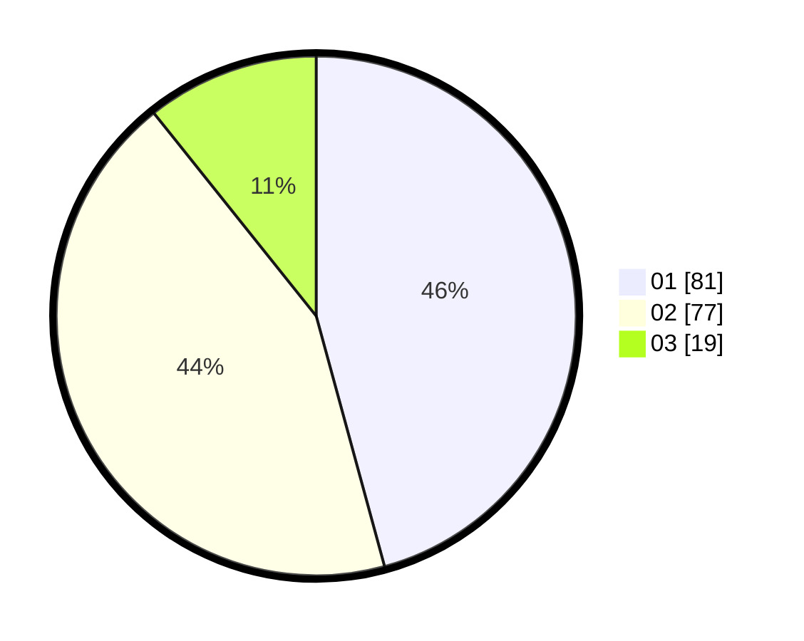

# Hasil

Hasil perolehan suara paslon dapat dilihat pada file paslon-01.txt, paslon-02.txt, dan paslon-03.txt.

Jika tidak ada, artinya data tersebut belum ada pada SIREKAP.

## Perolehan Suara

 * Paslon 01: **81**.
 * Paslon 02: **77**.
 * Paslon 03: **19**.

## Foto C Plano

https://sirekap-obj-formc.kpu.go.id/6edc/pemilu/ppwp/31/75/06/10/01/3175061001105-20240214-194056--3f096f48-a8b2-4fb0-aae8-3b7cbf77de66.jpg

https://sirekap-obj-formc.kpu.go.id/6edc/pemilu/ppwp/31/75/06/10/01/3175061001105-20240214-193741--73ea9d6a-d1a2-4292-bc70-c8c925872e4f.jpg

https://sirekap-obj-formc.kpu.go.id/6edc/pemilu/ppwp/31/75/06/10/01/3175061001105-20240214-193946--5d92a1fd-72ad-4995-a83e-26c6389fa6e2.jpg
